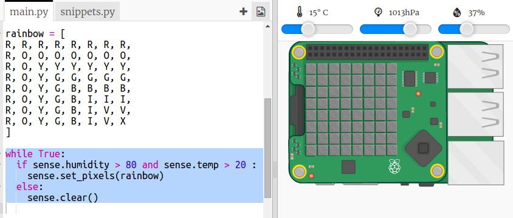

## 무지계 예측하기

무지개는 햇빛이 물방울을 통해 직각으로 비칠 때 생깁니다.(주로 오후에) 따뜻하고 습도가 높으면, 무지개가 있는지 확인하는 것이 좋습니다.

+ 조건이 맞다면 무지개만 보이도록 하겠습니다. 코드를 수정해 다음과 같이 만듭니다.
    
    
    
    이러한 조건이 충족 될 때 무지개가 있는지 확신 할 수는 없지만 살펴볼 가치가 있습니다.

+ 무지개가 보일 때까지 슬라이더의 값을 변경하십시오.
    
    
    
    보고 된 값은 슬라이더에 표시된 값과 정확히 동일하지 않다는 것을 기억하세요.

+ *임계값* 은 중요한 변화를 나타내는 숫자입니다. 20°C 및 80% 습도는 무지개 감지기의 임계값 입니다.
    
    임계값을 변경한 다음 슬라이더를 움직여 무지개를 만들어보세요.
    
    실제 Sense Hat으로 작업하는 경우, 임계값을 낮은 값으로 설정하여 여러분의 코드를 테스트 할 수 있습니다.