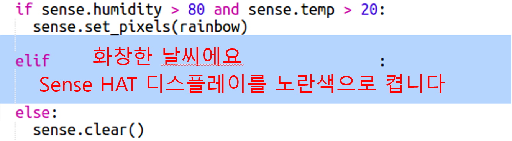

--- challenge ---

## 도전과제: 더 많은 날씨

온도가 20 이상이고 습도가 80 % 미만일 때 태양 이미지를 표시 할 수 있습니까?

팁: `elif`를 사용하여 다른 종류의 날씨를 확인합니다. 각 종류의 날씨에 대해 날씨의 종류를 확인하기 위한 조건을 포함하고, Sense Hat의 디스플레이를 설정하기 위해 코딩해야 합니다.

팁: `clear()`을 사용하여 모든 픽셀을 노란색으로 설정하여 간단한 태양을 만들 수 있습니다. 또는, 무지개에서 했던 것 처럼 픽셀 이미지를 만들 수 있습니다.

습도가 80 % 이상이고 온도가 0보다 낮으면 눈 이미지를 보여주는 것은 어떤가요?

팁: 흰색을 만드려면 빨강, 녹색 및 파랑을 255로 설정하세요.

--- /challenge ---

***
이 프로젝트는 아래 자원 봉사자들에 의해 번역되었습니다:

Sunwoo Jang

강태원

번역 봉사자들 덕분에 우리는 전 세계 사람들에게 프로그래밍을 모국어로 배울 수 있는 기회를 제공하고 있습니다. 번역 봉사에 동참해서 더 많은 사람들에게 프로그래밍을 배울 수 있는 기회를 제공하세요 - [rpf.io/translate](https://rpf.io/translate)에서 더 많은 정보를 확인하세요.