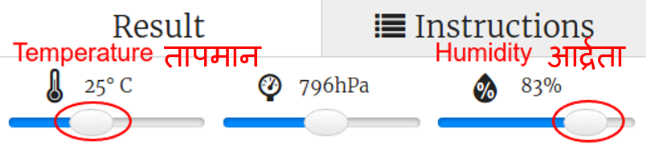

## परिचय:

या प्रोजेक्ट मध्ये इंद्रधनुष्य दाखविण्याची चांगली संधी कधी येईल याचा अंदाज लावण्यासाठी आपण Sense HAT तापमान आणि आर्द्रता सेन्सर वापरू या. जेव्हा योग्य परिस्थिती आढळल्यास आपण Sense HAT LED Matrix प्रदर्शित कराल.

  <iframe src="https://trinket.io/embed/python/eaea4cb76c?outputOnly=true&start=result" width="600" height="500" frameborder="0" marginwidth="0" marginheight="0" allowfullscreen>
</iframe> 

Trinket emulator मध्ये आपण स्लाइडरला तापमान आणि आर्द्रता बदलण्यासाठी हलवू शकता, ते असे दिसतात:

जर तापमान 20 डिग्री सेल्सियसपेक्षा जास्त असेल आणि आर्द्रता 80 टक्क्यांपेक्षा जास्त असेल तर आपणास इंद्रधन्युष्य मिळेल. सूर्यप्रकाश (पिवळा) आणि बर्फ (पांढरा) हवामानाची स्थिती शोधण्यासाठी प्रयोग करून पहा.

### क्लब प्रमुखांसाठी अतिरिक्त माहिती

तुम्हाला हा प्रकल्प प्रिंट करण्याची आवश्यकता असल्यास, कृपया [प्रिंट अनुकूल आवृत्ती](https://projects.raspberrypi.org/en/projects/rainbow-predictor/print) वापरा.

## \--- collapse \---

## title: क्लब लीडर नोट्स

## परिचय:

या प्रोजेक्ट मध्ये, मुले हवामान शोधण्यासाठी Sense HAT सेन्सर्स कसे वापरावेत हे जाणून घेतील आणि उबदार आणि दमट असताना LED matrix चा वापर करून इंद्रधन्युष्य प्रदर्शित करतील.

## ऑनलाईन संसाधने

हा प्रोजेक्ट **Python 3** चा वापर करतो. Python ऑनलाईन लिहिण्यासाठी आम्ही [trinket](https://trinket.io/) वापरण्याचा सल्ला देतो. ह्या प्रोजेक्ट मध्ये खालील Trinkets आहेत:

* ['इंद्रधनुष्य पूर्वानुमानकर्ता' स्टार्टर Trinket -- jumpto.cc/rainbow-go](http://jumpto.cc/rainbow-go)

येथे finished झालेले project असलेले एक trinket देखील आहे:

* [‘Rainbow Predictor’ Finished -- trinket.io/python/eaea4cb76c](https://trinket.io/python/eaea4cb76c)

## ऑफलाइन संसाधने

हा प्रोजेक्ट Raspberry Pi संगणकावर Sense HAT सह [ऑफलाइन](https://www.codeclubprojects.org/en-GB/resources/physical-sense-hat/) देखील पूर्ण केला जाऊ शकतो. तुम्ही या प्रोजेक्टची संसाधने 'Project Materials' लिंकवर​ क्लिक करून मिळवू शकता. या लिंक मध्ये 'Project Resources' हा विभाग आहे, ज्यामध्ये संसाधने आहेत जी मुलांना हा प्रोजेक्ट ऑफलाइन पूर्ण करण्यासाठी आवश्यकअसतील. प्रत्येक मुलाकडे या संसाधनेच्या प्रतीला ऍक्सेस असण्याची खात्री करा. या विभागात खालील फाईल्स समाविष्ट आहेत:

* rainbow/rainbow.py

तुम्हाला याप्रोजेक्ट मधील आव्हानांची पूर्ण आवृत्ती 'Volunteer Resources' विभागात सापडेल, ज्यात खालील बाबी आहेत:

* rainbow-finished/rainbow.py

(वरील सर्व प्रोजेक्टची संसाधने आणि स्वयंसेवकासाठी `.zip` फाईल म्हणून डाउनलोड करण्याची सोय केलेली आहे.)

## शिकण्याचे उद्दिष्टे

* Physical कॉम्पुटिंग - सेन्सर;
* बुलियन आणि; 
* RGB रंग;
* Sense HAT प्रदर्शन;

This project covers elements from the following strands of the [Raspberry Pi Digital Making Curriculum](https://rpf.io/curriculum):

* [समस्या सोडवण्यासाठी प्रोग्रामिंग संकल्पना एकत्र करा.](https://www.raspberrypi.org/curriculum/programming/builder)

## आव्हाने

* अधिक हवामान - भिन्न हवामान परिस्थितीत भिन्न images प्रदर्शित करा. 

\--- /collapse \---

## \--- collapse \---

## title: प्रोजेक्ट मटेरियल्स

## प्रोजेक्ट रिसोर्सेस

* [स्टार्टर प्रोजेक्ट](http://jumpto.cc/rainbow-go)
* [ऑफलाइन स्टार्टर Python file](resources/rainbow-rainbow.py)

## क्लब प्रमुख संसाधने

* [ऑनलाइन पूर्ण झालेले Trinket प्रोजेक्ट](https://trinket.io/python/eaea4cb76c)
* [rainbow-finished/rainbow.py](resources/rainbow-final-rainbow.py)

\--- /collapse \---