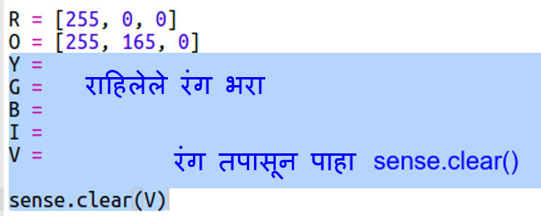

## इंद्रधन्युष्याचे रेखांकन

प्रथम Sense HAT चा वापर करून इंद्रधनुष्य काढा. लाल, नारंगी, पिवळा, हिरवा, निळा, इंडिगो आणि व्हायलेट हे रंग आहेत.

स्वतंत्र LEDचा रंग सेट करण्यासाठी 0 ते 255 पर्यंत किती लाल, हिरवा आणि निळा असावा हे सांगायला हवे.

+ Rainbow Predictor Starter Trinket: <a href="http://jumpto.cc/rainbow-go" target="_blank">jumpto.cc/rainbow-go</a> उघडा.
    
    **Sense HAT सेट करण्यासाठी आपल्याला code दिले गेले आहे.**

+ लाल रंगासाठी व्हेरिएबल सेट करण्यासाठी हायलाइट केलेला code जोडा आणि `sense.clear(R)` वापरा:
    
    
    
    आपण मोठे अक्षर `R` वापरल्याची खात्री करा.

+ नारिंगी नंतर आहे. नारंगी साठी हिरव्या रंगात लाल मिसळला जातो. आपल्या आवडीनुसार केशरी होईपर्यंत आपण संख्या समायोजित करू शकता. `sense.clear(O)` यावेळी नवीन रंगाची चाचणी घेण्यासाठी, मोठ्या अक्षरा `O` कंसात वापरा.
    
    

+ आता `Y`, `G`, `B`, `I`, `V` व्हेरीएबल्स वापरा जेणेकरून आपल्याला इंद्रधनुष्याचे सात रंग मिळतील. <a href="http://jumpto.cc/colours" target="_blank">jumpto.cc/colours</a> वर अधिक RGB रंगांची नावे मिळू शकतात
    
    आपण `sense.clear()` वापरून आपल्या रंगांची चाचणी घेऊ शकता.
    
    

+ पिक्सेल बंद ठेवण्यासाठी (लाल, हिरवा किंवा निळा नाही) व्हेरिएबल `X` जोडा:
    
    

+ आता इंद्रधन्युष्य काढण्याची वेळ आली आहे. आपल्याला प्रत्येक पिक्सेलचा रंग असलेली एक सूची सेट करणे आवश्यक आहे आणि नंतर `set_pixels` रंगांच्या सूचीसह कॉल करा. टाइप वाचवण्यासाठी आपण `snippets.py` आपल्या प्रोजेक्ट मधून कॉपी करु शकता.
    
    