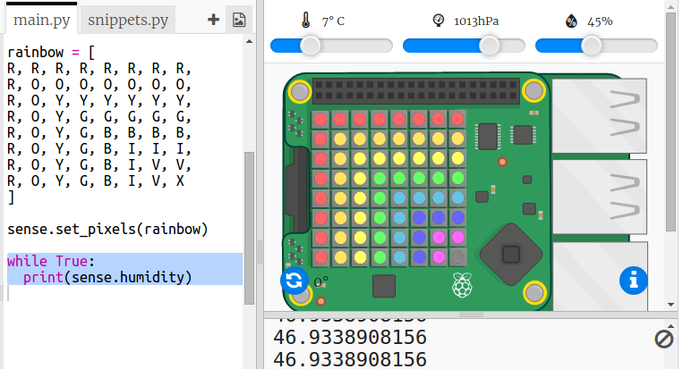

## सेन्सर डेटा वाचन

Sense HAT मध्ये सेन्सर्सची श्रेणी असते जी Raspberry Pi संगणकावर वास्तविक जगाचा डेटा प्रदान करतात. Trinklet मधील Sense HAT Emulator आपल्याला आपल्या वेब ब्राउझर मध्ये Sense HAT साठी प्रोजेक्ट लिहिण्याची आणि चाचणी घेण्यास अनुमती देते.

आर्द्रता सेन्सर हवेतील ओलाव्याचे प्रमाण दर्शविते. पाऊस पडल्यास आर्द्रता जास्त असते.

+ चला आपण आर्द्रता सेन्सरमधून वाचू आणि परिणाम प्रिंट आउट करू. आपल्या स्क्रिप्टच्या खाली हायलाइट केलेला code जोडा.
    
    

+ आर्द्रता स्लाइडरला भिन्न मूल्यांमध्ये हलवून आपल्या प्रोग्रामची चाचणी घ्या.
    
    
    
    लक्षात घ्या की आर्द्रता सेन्सरमधून आपणास मिळणारे मूल्य स्लाइडरवरील मूल्या इतकेच नाही. याचे सेन्सर पूर्णपणे अचूक नसणे आहे.