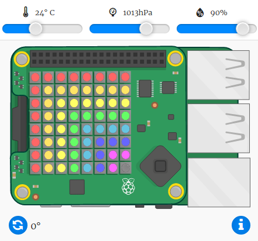

## इंद्रधन्युष्याचे अंदाज देणे

जेव्हा उजव्या कोनातून (सहसा दुपारी) पाण्याच्या थेंबातून सूर्य चमकतो तेव्हा इंद्रधनुष्य होतो. जर ते उबदार असेल आणि आर्द्रता जास्त असेल तर इंद्रधनुष्य आहे का ते तपासणे योग्य आहे.

+ आता परिस्थिती योग्य असल्यास इंद्रधन्युष्य दाखवू. आपला कोड यासारखे दिसण्यासाठी बदला:
    
    
    
    जेव्हा या अटी पूर्ण झाल्यास आपणास इंद्रधनुष्य असल्याचे खात्री होणा नाही, तरी सुद्धा हे पाहणे योग्य आहे.

+ जो पर्यंत आपल्याला इंद्रधन्युष्य दिसत नाही तो पर्यंत स्लाइडरवरील मूल्ये बदलण्याचा प्रयत्न करत रहा.
    
    
    
    लक्षात ठेवा नोंदवलेली मूल्ये स्लाइडर्स वर दर्शविल्या गेलेल्या सारख्या नसतील.

+ *threshold* एक महत्वाची बदल दर्शविणारी संख्या आहे. इंद्रधनुष्य शोधकांसाठी 20 डिग्री सेल्सियस आणि 80% आर्द्रता आरंभ आहे.
    
    थ्रेशोल्डस बदलण्याचा प्रयत्न करा आणि नंतर इंद्रधनुष्य ट्रिगर करण्यासाठी स्लाइडर हलवून घ्या.
    
    जर आपण फिजिकल Sense HAT बरोबर काम करत असाल तर आपण थ्रेशहोल्ड्स कमी मूल्यांवर सेट करुन आपल्या codeची चाचणी घेऊ शकता.