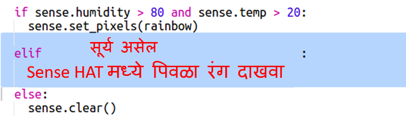

--- challenge ---

## आव्हान: अधिक हवामान

जेव्हा तापमान 20 च्या वर असेल आणि आर्द्रता 80% पेक्षा कमी असेल तेव्हा आपण सूर्याची image दर्शवू शकता?

टीपः इतर प्रकारचे हवामान तपासण्यासाठी `elif` चा वापर करा. प्रत्येक प्रकारच्या हवामानासाठी आपल्याला एक प्रकारचे हवामान तपासण्यासाठी अट आणि नंतर Sense HAT वर प्रदर्शन सेट करण्यासाठी code समाविष्ट करणे आवश्यक आहे.

टीपः `clear()` सह सर्व पिक्सेल पिवळ्या रंगात बसवून आपण एक साधा सूर्य तयार करू शकता. किंवा इंद्रधन्युषा प्रमाणे आपण पिक्सेल प्रतिमा तयार करण्याचा प्रयत्न करू शकता.

जर आर्द्रता 80% च्या वर असेल आणि तापमान शून्यापेक्षा कमी असेल तर बर्फाच्या imageचे काय?

टीपः पांढरा तयार करण्यासाठी लाल, हिरवा आणि निळा कमाल 255 वर सेट करा.

--- /challenge ---

***
या प्रकल्पाचे भाषांतर स्वयंसेवकांनी केले:

Ashish Potdar

Sunil Misal

स्वयंसेवकांचे आभार, आम्ही जगभरातील लोकांना त्यांच्या भाषेतून शिकण्याची संधी देऊ शकतो. आपण आम्हाला भाषांतर करण्यासाठी स्वयंसेवा करून अधिक लोकांपर्यंत पोहोचण्यास मदत करू शकता - अधिक माहिती [rpf.io/translate](https://rpf.io/translate) वर.