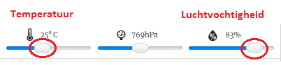

## Inleiding:

In dit project gebruik je de temperatuur- en vochtigheidssensoren op de Sense HAT om te voorspellen wanneer er een goede kans is om een regenboog te zien. Wanneer de juiste voorwaarden worden gedetecteerd, toon je een regenboog op de Sense HAT LED matrix.

  <iframe src="https://trinket.io/embed/python/eaea4cb76c?outputOnly=true&start=result" width="600" height="500" frameborder="0" marginwidth="0" marginheight="0" allowfullscreen mark="crwd-mark">
</iframe> 

In de Trinket-emulator kun je de schuifregelaars verplaatsen om de temperatuur en de vochtigheid te veranderen, ze zien er als volgt uit:

Je krijgt een regenboog als de temperatuur hoger is dan 20 graden Celsius en de luchtvochtigheid hoger is dan 80 procent. Probeer te experimenteren om de weersomstandigheden voor zonneschijn (geel) en sneeuw (wit) te vinden.

### Aanvullende informatie voor clubleiders

Als je dit project wilt afdrukken, gebruik dan de [printervriendelijke versie](https://projects.raspberrypi.org/en/projects/rainbow-predictor/print).

## \--- collapse \---

## title: Opmerkingen voor docenten

## Inleiding:

In dit project leren kinderen hoe ze de Sense HAT-sensoren kunnen gebruiken om het weer te detecteren en hoe ze een regenboog kunnen weergeven met behulp van de LED-matrix als het warm en vochtig is.

## Online bronnen

**Dit project maakt gebruik van Python 3.** We raden aan om [Trinket](https://trinket.io/) te gebruiken om Python online te schrijven. Dit project bevat de volgende Trinkets:

* ['Regenboog Voorspeller' Start Trinket -- jumpto.cc/rainbow-go](http://jumpto.cc/rainbow-go)

Er is ook een trinket met het voltooide project:

* [‘Regenboog Voorspeller’ Voltooid -- trinket.io/python/eaea4cb76c](https://trinket.io/python/eaea4cb76c)

## Offline bronnen

Dit project kan ook [offline voltooid worden](https://www.codeclubprojects.org/en-GB/resources/physical-sense-hat/) op een Raspberry Pi-computer met een Sense HAT. Je kunt toegang krijgen tot de projectbronnen door op de koppeling 'Projectmaterialen' voor dit project te klikken. Deze link bevat een 'Projectbronnen'-sectie die bronnen bevat om dit project offline te voltooien. Zorg ervoor dat elk kind toegang heeft tot een kopie van deze bestanden. Dit gedeelte bevat de volgende bestanden:

* rainbow/rainbow.py

Je kunt ook een voltooide versie van dit project vinden in de sectie 'Vrijwilligersbronnen', die het volgende bevat:

* rainbow-finished/rainbow.py

(Alle bovenstaande bronnen kunnen ook worden gedownload als project en als vrijwilliger `.zip` bestanden.)

## Leerdoelen

* Fysiek computergebruik - sensoren;
* Booleaans EN; 
* RGB-kleuren;
* Sense HAT-weergave;

Dit project behandelt elementen uit de volgende onderdelen van het [Raspberry Pi Digital Making Curriculum](http://rpf.io/curriculum):

* [Combineer programmeerconstructies om een ​​probleem op te lossen.](https://www.raspberrypi.org/curriculum/programming/builder)

## Uitdagingen

* Meer weer - geef verschillende afbeeldingen weer onder verschillende weersomstandigheden. 

\--- /collapse \---

## \--- collapse \---

## title: Projectmaterialen

## Projectbronnen

* [.zip-bestand met alle projectbronnen](resources/rainbow-project-resources.zip)
* [Startproject](http://jumpto.cc/rainbow-go)
* [Offline start Python-bestand](resources/rainbow-rainbow.py)

## Clubleider bronnen

* [.zip-bestand met alle voltooide projectbronnen](resources/rainbow-volunteer-resources.zip)
* [Online voltooid Trinket-project](https://trinket.io/python/eaea4cb76c)
* [rainbow-finished/rainbow.py](resources/rainbow-final-rainbow.py)

\--- /collapse \---