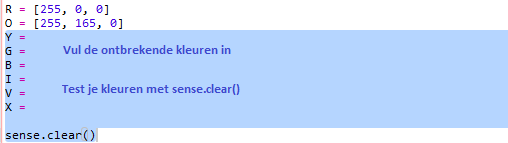

## Een regenboog tekenen

Laten we eerst een regenboog tekenen met de LED-matrix op de Sense HAT. De kleuren zijn rood, oranje, geel, groen, blauw, indigo en violet.

Om de kleur van een individuele LED in te stellen, moeten we zeggen hoeveel rood, groen en blauw deze moet hebben van 0 tot 255.

+ Open de Regenboog Voorspeller Start Trinket: <a href="http://jumpto.cc/rainbow-go" target="_blank">jumpto.cc/rainbow-go</a>.
    
    **De code voor het instellen van de Sense HAT is voor je meegeleverd.**

+ Voeg de gemarkeerde code toe om een variabele voor de kleur rood in te stellen en maak vervolgens alle pixels rood met `sense.clear(R)`:
    
    
    
    Zorg ervoor dat je een hoofdletter `R` gebruikt.

+ Oranje is de volgende. Oranje is rood vermengd met groen. Je kunt de getallen aanpassen tot je een oranje krijgt die je leuk vindt. Gebruik deze keer `sense.clear(O)` om de nieuwe kleur te testen, zorg ervoor dat je een hoofdletter `O` tussen de haakjes gebruikt.
    
    

+ Voeg nu variabelen `Y`, `G`, `B`, `I`, `V` toe, zodat je de zeven kleuren van de regenboog hebt. Je kunt RGB-kleuren opzoeken op <a href="http://jumpto.cc/colours" target="_blank">jumpto.cc/colours</a>
    
    Je kunt je kleuren testen met behulp van `sense.clear()`.
    
    

+ Voeg een variabele `X` toe voor het uitschakelen van pixels (geen rood, groen of blauw):
    
    

+ Nu is het tijd om een regenboog te tekenen. Je moet een lijst opstellen met de kleur van elke pixel en vervolgens `set_pixels` aanroepen met de lijst met kleuren. Om typen te besparen, kun je de regenboog kopiëren van `snippets.py` in je project.
    
    