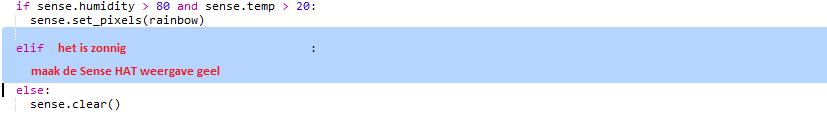

\--- challenge \---

## Uitdaging: meer weer

Kun je een afbeelding van de zon tonen als de temperatuur hoger is dan 20 en de luchtvochtigheid lager is dan 80%.

Tip: gebruik `elif` om te controleren op andere soorten weer. Voor elk weertype moet je een voorwaarde opnemen om te controleren op een soort weer en vervolgens de code om de weergave op de Sense HAT in te stellen.

Tip: je kunt een eenvoudige zon maken door alle pixels in te stellen op geel met `clear()`. Of je kunt proberen een pixelafbeelding te maken, zoals je hebt gedaan met de regenboog.

Wat dacht je van een afbeelding van sneeuw als de luchtvochtigheid boven de 80% is en de temperatuur onder nul.

Tip: Stel rood, groen en blauw in op het maximum van 255 om wit te maken.

\--- /challenge \---