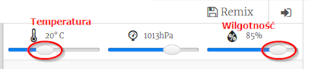

## Wprowadzenie:

W tym projekcie użyjesz czujnika temperatury i wilgotności w matrycy Sense HAT, aby przewidzieć czy jest duża szansa na zaobserwowanie tęczy. Po wykryciu odpowiednich warunków na matrycy LED Sense HAT wyświetli się tęcza.

  <iframe src="https://trinket.io/embed/python/eaea4cb76c?outputOnly=true&start=result" width="600" height="500" frameborder="0" marginwidth="0" marginheight="0" allowfullscreen>
</iframe> 

W emulatorze Trinket możesz przesuwać suwaki, żeby zmieniać temperaturę i wilgotność. Wyglądają one tak:

Otrzymasz tęczę, jeśli temperatura wynosi ponad 20 stopni C, a wilgotność przekracza 80 procent. Spróbuj poeksperymentować, aby znaleźć warunki pogodowe dla słońca (żółty) i śniegu (biały).

### Dodatkowe informacje dla prowadzących klub

Jeśli chcesz wydrukować ten projekt, użyj [wersji do druku](https://projects.raspberrypi.org/en/projects/rainbow-predictor/print).

## \--- collapse \---

## title: Notatki dla liderów klubów

## Wprowadzenie:

W tym projekcie dzieci dowiedzą się, jak używać czujników Sense HAT aby wykrywać pogodę i wyświetlać tęczę za pomocą matrycy LED, gdy jest ciepło i wilgotno.

## Zasoby Online

**Ten projekt używa Python 3.** Zalecamy użycie [Trinket](https://trinket.io/) do pisania kodu w Pythonie online. Ten projekt zawiera następujące szablony:

* [Początkowy Trinket 'Prognoza Tęczy' -- jumpto.cc/rainbow-go](http://jumpto.cc/rainbow-go)

Jest też Trinket zawierający ukończony projekt:

* [Uakończona „prognoza tęczy” - trinket.io/python/eaea4cb76c](https://trinket.io/python/eaea4cb76c)

## Zasoby Offline

Ten projekt można również [ukończyć offline](https://www.codeclubprojects.org/en-GB/resources/physical-sense-hat/) na komputerze Raspberry Pi z Sense HAT. Materiały potrzebne do wykonania projektu dostępne są po kliknięciu linku "Materiały do projektu". Można znaleźć tam sekcję "Źródła", która zawiera zasoby, potrzebne dzieciom do wykonania projektu w wersji offline. Upewnij się, że każde dziecko ma dostęp do tych zasobów. Ta sekcja zawiera następujące pliki:

* rainbow/rainbow.py

Ukończoną wersję tego projektu można również znaleźć w sekcji "Zasoby dla wolontariuszy", która zawiera:

* rainbow-finished/rainbow.py

(Wszystkie powyższe zasoby można również pobrać jako pliki `.zip`.)

## Cele dydaktyczne

* Fizyczne przetwarzanie danych - czujniki;
* Funkcja AND (koniunkcja) w Logice ; 
* Kolory RGB;
* Wyświetlacz Sense HAT;

Projekt ten obejmuje następujące elementy [Cyfrowego programu nauczania Raspberry Pi](https://rpf.io/curriculum):

* [Połącz konstrukcje programistyczne, aby rozwiązać problem.](https://www.raspberrypi.org/curriculum/programming/builder)

## Wyzwania

* Więcej pogody - wyświetlaj różne obrazy w różnych warunkach pogodowych. 

\--- /collapse \---

## \--- collapse \---

## title: Materiały do projektu

## Zasoby projektu

* [Projekt początkowy](http://jumpto.cc/rainbow-go)
* [Startowy plik w Python - wersja offline](resources/rainbow-rainbow.py)

## Zasoby dla lidera klubu

* [Skończony online projekt Trinket](https://trinket.io/python/eaea4cb76c)
* [rainbow-finished/rainbow.py](resources/rainbow-final-rainbow.py)

\--- /collapse \---