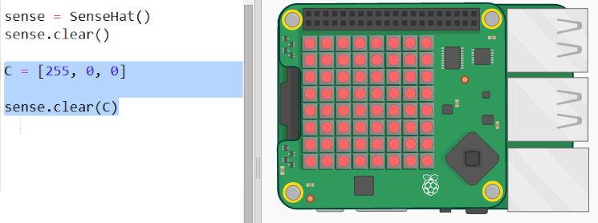
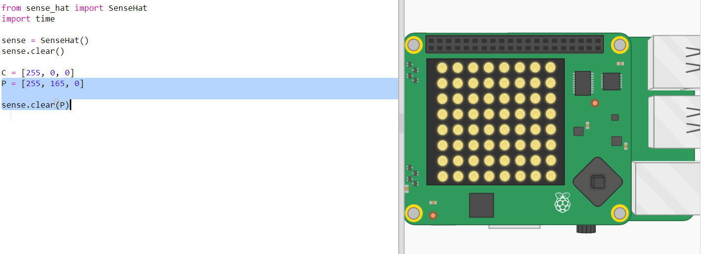
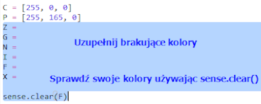
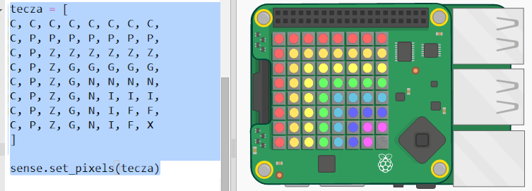

## Rysowanie tęczy

Najpierw narysujmy tęczę za pomocą matrycy LED na Sense HAT. Kolory to czerwony, pomarańczowy, żółty, zielony, niebieski, indygo i fioletowy.

Aby ustawić kolor pojedynczej diody LED, musimy powiedzieć, ile powinna ona mieć czerwonego, zielonego i niebieskiego od 0 do 255.

+ Otwórz startowy Trinket Prognozy Tęczy: <a href="http://jumpto.cc/rainbow-go" target="_blank">jumpto.cc/rainbow-go</a>.
    
    **Kod służący do konfiguracji Sense HAT został już za Ciebie dołączony.**

+ Dodaj podświetlony kod, aby ustawić zmienną dla koloru Czerwonego, a następnie zmień wszystkie piksele na czerwono za pomocą ` sense.clear (C) `:
    
    
    
    Upewnij się, że użyłeś dużej litery `C`.

+ Pomarańczowy jest następny. Pomarańczowy to czerwony wymieszany z zielonym. Możesz zmieniać liczby, aż pojawi się pomarańczowy, który ci się spodoba. Użyj `sense.clear(P)` tym razem przetestuj nowy kolor, pamiętając o użyciu dużej litery `P` w nawiasach.
    
    

+ Teraz dodaj zmienne `Z`, `G`, `N`, `I`, `F` abyś miał siedem kolorów tęczy. Możesz znaleźć kolory RGB na <a href="http://jumpto.cc/colours" target="_blank">jumpto.cc/colours</a>
    
    Możesz przetestować swoje kolory za pomocą `sense.clear()`.
    
    

+ Dodaj zmienną `X` w celu wyłączenia pikseli (brak czerwonego, zielonego lub niebieskiego):
    
    

+ Teraz jest czas, żeby narysować tęczę. Musisz utworzyć listę zawierającą kolor każdego piksela i później wywołać funkcje `set_pixels` z listą kolorów. Aby zapisać pisanie, możesz skopiować tęczę z `snippets.py` w twoim projekcie.
    
    