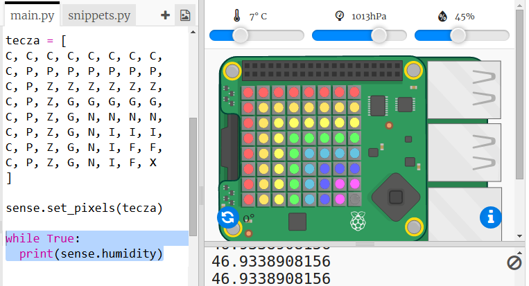

## Odczytywanie danych z czujnika

Sense HAT ma szereg czujników, które dostarczają dane ze świata rzeczywistego do komputera Raspberry Pi. Emulator Sense HAT w Trinket umożliwia pisanie i testowanie projektów dla Sense HAT w przeglądarce internetowej.

Czujnik wilgotności podaje wilgotność powietrza. Wilgotność jest wysoka, gdy pada deszcz.

+ Odczytajmy dane z czujnika wilgotności i wypiszmy wynik. Dodaj podświetlony kod na dole skryptu.
    
    

+ Przetestuj swój program, przesuwając suwak wilgotności do różnych wartości.
    
    
    
    Zauważ, że wartość zwracana z czujnika wilgotności nie jest dokładnie taka sama jak wartość na suwaku. Jest tak, ponieważ czujniki nie są idealnie dokładne.