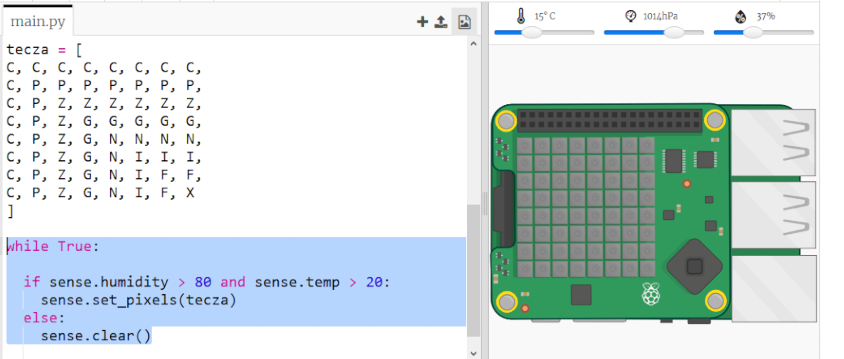

## Przewidywanie tęczy

Rainbows happen when the sun shines through water droplets at the right angle (usually in the afternoon). If it's warm and the humidity is high then it's worth checking to see if there's a rainbow.

+ Teraz pokażmy tęczę tylko wtedy, gdy warunki są odpowiednie. Zmień kod, aby wyglądał następująco:
    
    
    
    Nie możesz być pewien, że tęcza pojawi się gdy warunki zostaną spełnione, ale warto sprawdzić.

+ Spróbuj zmieniać wartości na suwaku, aż zobaczysz tęczę.
    
    
    
    Pamiętaj, że odczytane wartości nie będą dokładnie takie same jak te pokazane na suwakach.

+ *Próg* to liczna wskazująca ważną zmianę. 20 stopni C i wilgotność 80% to progi dla detektora tęczy.
    
    Spróbuj zmienić progi, a następnie przesuń suwaki, aby uruchomić tęczę.
    
    Jeśli pracujesz z prawdziwym Sense HATem, możesz przetestować kod, ustawiając progi na niskie wartości.