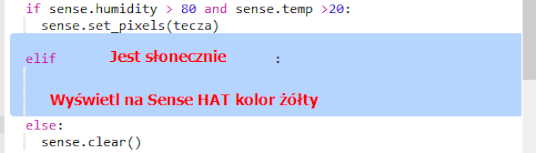

\--- challenge \---

## Wyzwanie: Więcej pogody

Czy możesz wyświetlić obraz słońca, gdy temperatura wynosi powyżej 20, a wilgotność jest poniżej 80%.

Wskazówka: użyj `elif` aby sprawdzić inne rodzaje pogody. Dla każdego rodzaju pogody musisz uwzględnić warunek, aby sprawdzał rodzaj pogody, a następnie kod, aby ustawił wyświetlanie na Sense HAT.

Wskazówka: Możesz utworzyć proste słońce, ustawiając wszystkie piksele na żółte za pomocą `clear()`. Możesz też spróbować utworzyć pikselowy obraz, jak w przypadku tęczy.

Może zrobisz też obraz śniegu gdy wilgotność jest powyżej 80% i temperatura jest poniżej zera.

Wskazówka: Ustaw czerwony, zielony i niebieski na maksymalnie 255, aby utworzyć biały.

\--- /challenge \---