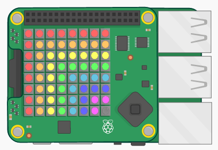
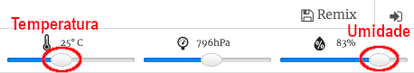

## Introdução:

In this project you will use the temperature and humidity sensors on the Sense HAT to predict when there’s a good chance of spotting a rainbow. When the right conditions are detected you will display a rainbow on the Sense HAT LED Matrix.

  <iframe src="https://trinket.io/embed/python/eaea4cb76c?outputOnly=true&start=result" width="600" height="500" frameborder="0" marginwidth="0" marginheight="0" allowfullscreen mark="crwd-mark">
</iframe> 

In the Trinket emulator you can move the sliders to change the temperature and humidity, they look like this:

You'll get a rainbow if the temperature is over 20 degrees C and the humidity is over 80 percent. Try experimenting to find the weather conditions for sunshine (yellow) and snow (white).

### Informação adicional para líderes de clubes

Se você precisar imprimir este projeto, use a [Versão para Impressão](https://projects.raspberrypi.org/en/projects/rainbow-predictor/print).

## \--- collapse \---

## title: Notas do líder do clube

## Introdução:

In this project, children will learn how to use the Sense HAT sensors to detect the weather, and display a rainbow using the LED matrix when it's warm and humid.

## Recursos Online

**This project uses Python 3.** We recommend using [Trinket](https://trinket.io/) to write Python online. Este projeto contém os seguintes Trinkets:

* ['Rainbow Predictor' Starter Trinket -- jumpto.cc/rainbow-go](http://jumpto.cc/rainbow-go)

Há também uma trinket contendo o projeto concluído:

* [‘Rainbow Predictor’ Finished -- trinket.io/python/eaea4cb76c](https://trinket.io/python/eaea4cb76c)

## Recursos Offline

This project can also be [completed offline](https://www.codeclubprojects.org/en-GB/resources/physical-sense-hat/) on a Raspberry Pi computer with a Sense HAT. Você pode acessar os recursos do projeto clicando no link 'Materiais do Projeto' para este projeto. Este link contém uma seção 'Recursos do Projeto', que inclui recursos que as crianças precisarão para concluir esse projeto off-line. Certifique-se de que cada criança tenha acesso a uma cópia desses recursos. Esta seção inclui os seguintes arquivos:

* rainbow/rainbow.py

Você também pode encontrar uma versão completa deste projeto na seção 'Recursos para Voluntários', que contém:

* rainbow-finished/rainbow.py

(Todos os recursos acima também podem ser baixados como arquivos `.zip` do projeto e dos voluntários.)

## Objetivos de aprendizado

* Physical computing - sensors;
* Boolean AND; 
* RGB Colours;
* Sense HAT display;

Este projeto abrange elementos das seguintes vertentes do [Currículo de Criação Digital Raspberry Pi](http://rpf.io/curriculum):

* [Combine construções de programação para resolver um problema.](https://www.raspberrypi.org/curriculum/programming/builder)

## Desafios

* More Weather - display different images under different weather conditions. 

\--- /collapse \---

## \--- colapso \---

## Título: Materiais do projeto

## Recursos do projeto

* [arquivo.zip contendo todos os recursos do projeto](resources/rainbow-project-resources.zip)
* [Projeto inicial](http://jumpto.cc/rainbow-go)
* [Offline starter Python file](resources/rainbow-rainbow.py)

## Recursos do líder do clube

* [arquivo .zip contém todos os recursos do projeto](resources/rainbow-volunteer-resources.zip)
* [Projeto Trinket online e completo](https://trinket.io/python/eaea4cb76c)
* [rainbow-finished/rainbow.py](resources/rainbow-final-rainbow.py)

\--- /collapse \---