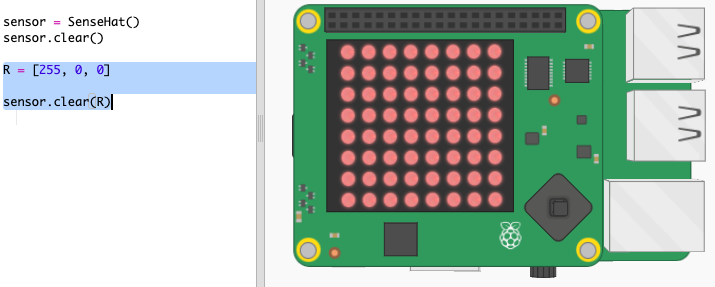
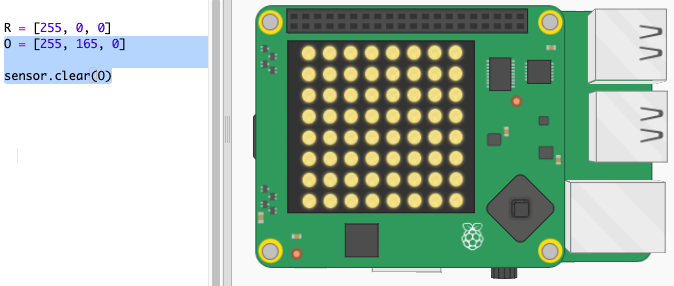
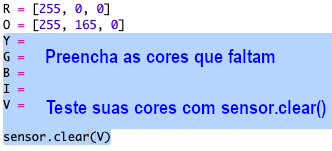
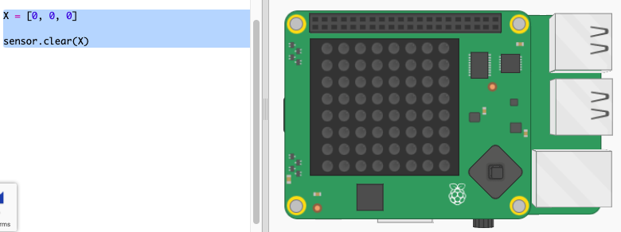
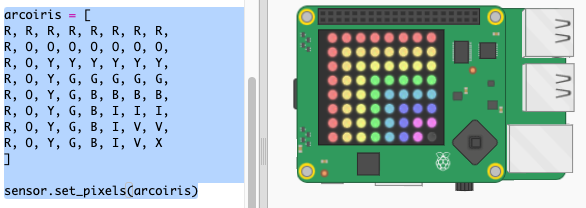

## Desenhando um arco-íris

Primeiro, vamos desenhar um arco-íris usando a Matriz de LEDs no Sense HAT. As cores são Vermelho (red = R), Laranja (orange = O), Amarelo (yellow = Y), Verde (green = G), Azul (blue = B), Índigo (indigo = I) e Violeta (violet = V).

Para definir a cor de um LED individual, precisamos dizer quanto vermelho, verde e azul ele deve ter de 0 a 255.

+ Abra o Trinket 'Previsor de Arco-íris' versão inicial: <a href="https://trinket.io/python/54270eee8d" target="_blank">trinket.io/python/54270eee8d</a>.
    
    **O código para configurar o Sense HAT foi incluído para você.**

+ Adicione o código destacado para configurar uma variável para a cor Vermelho e depois torne todos os pixels vermelhos usando `sensor.clear(R)` (R = red = vermelho):
    
    
    
    Certifique-se de usar a letra maiúscula `R`.

+ A cor Laranja é a próxima. Laranja é vermelho misturado com verde. Você pode ajustar os números até obter a tom de laranja que desejar. Use agora o `sensor.clear(O)` (O = orange = laranja) para testar a nova cor, certificando-se de usar a letra maiúscula `O` entre parênteses.
    
    

+ Agora adicione variáveis `Y` (Y = yellow = amarelo), `G` (G = green = verde), `B` (B = blue = azul), `I` (I = indigo = índigo), `V` (V = violet = violeta) para que você tenha as sete cores do arco-íris. Você pode encontrar mais cores RGB em <a href="http://jumpto.cc/colours" target="_blank">jumpto.cc/colors</a>
    
    Você pode testar suas cores usando `sensor.clear()`.
    
    

+ Adicione uma variável `X` para desativar os pixels (sem vermelho, verde ou azul):
    
    

+ Agora é hora de desenhar um arco-íris. Você precisa configurar uma lista contendo a cor de cada pixel e usar `set_pixels` com a lista de cores. Para não precisar digitar, você pode copiar o arco-íris de `snippets.py` em seu projeto.
    
    