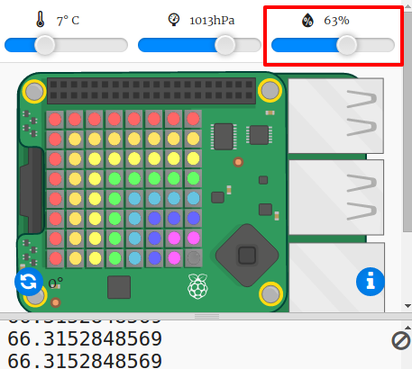

## Lendo os dados do sensor

O Sense HAT possui uma série de sensores que fornecem dados do mundo real em um computador Raspberry Pi. O emulador do Sense HAT no Trinket permite escrever e testar projetos para o Sense HAT no seu navegador web.

O sensor de umidade relata a quantidade de umidade no ar. A umidade é alta quando chove.

+ Vamos ler a partir do sensor de umidade e imprimir o resultado. Adicione o código destacado na parte inferior do seu script.
    
    

+ Teste seu programa movendo o controle deslizante de umidade para diferentes valores.
    
    
    
    Observe que o valor que você recebe do sensor de umidade não é exatamente o mesmo que o valor indicado no controle deslizante. Isto acontece porque os sensores não são perfeitamente precisos.