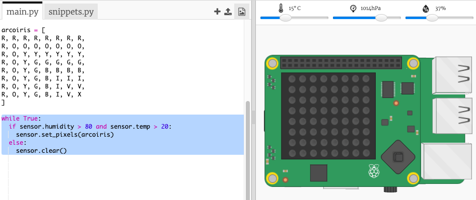

## Prevendo um arco-íris

Os arco-íris acontecem quando o sol brilha através das gotas de água em um determinado ângulo (geralmente à tarde). Se estiver quente e a umidade estiver alta, vale a pena verificar se há um arco-íris.

+ Agora vamos fazer com que o arco-íris apareça apenas quando as condições estiverem corretas. Altere seu código para que fique assim:
    
    
    
    Você pode não ter certeza de que existe um arco-íris quando essas condições são atendidas, mas vale a pena dar uma olhada.

+ Tente alterar os valores nos controles deslizantes até você ver o arco-íris.
    
    
    
    Lembre-se de que os valores indicados não serão exatamente iguais aos mostrados nos controles deslizantes.

+ Um *limiar* é um número que indica uma mudança importante. 20ºC e 80% de umidade são os limiares para o detector de arco-íris.
    
    Tente alterar os limiares e então mova os controles deslizantes para acionar um arco-íris.
    
    Se você estiver trabalhando com um Sense HAT físico, poderá testar seu código configurando os limiares para valores baixos.