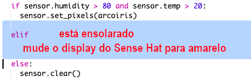
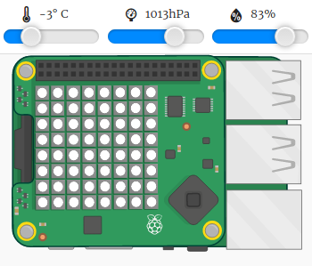

--- challenge ---

## Desafio: Mais Clima

Você consegue exibir uma imagem do sol quando a temperatura estiver acima de 20ºC e a umidade estiver abaixo de 80% ?

Dica: use `elif` para verificar outros tipos de clima. Para cada tipo de clima, você precisará incluir uma condição para verificar o tipo de clima e, em seguida, escrever o código para definir o que deve ser exibido no Sense HAT.

Dica: Você pode criar um sol simples definindo todos os pixels para amarelo com `clear()`. Ou você pode tentar criar uma imagem de pixels como você fez com o arco-íris.

Que tal uma imagem de neve se a umidade estiver acima de 80% e a temperatura estiver abaixo de zero ?

Dica: Para criar branco, deixe o vermelho, verde e azul para 255 (valor máximo).

--- /challenge ---