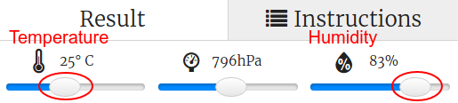

## Introducere:

În acest proiect, vei folosi senzorii de temperatură și umiditate de pe Sense HAT pentru a prezice când există o șansă bună de a depista curcubeul. Când condițiile corecte sunt detectate, vei afișa un curcubeu pe matricea Sense HAT.

  <iframe src="https://trinket.io/embed/python/eaea4cb76c?outputOnly=true&start=result" width="600" height="500" frameborder="0" marginwidth="0" marginheight="0" allowfullscreen>
</iframe> 

În emulatorul Trinket, poți muta sliderele pentru a schimba temperatura și umiditatea. Ele arată astfel:

Vei obține un curcubeu dacă temperatura este peste 20 de grade Celsius și umiditatea este peste 80 la sută. Încearcă să experimentezi pentru a găsi condițiile meteorologice pentru lumina soarelui (galben) și zăpadă (alb).

### Informații suplimentare pentru conducătorii de club

Dacă vrei să printezi acest proiect, folosește [Versiunea printabilă](https://projects.raspberrypi.org/en/projects/rainbow-predictor/print).

## \--- collapse \---

## title: Note pentru conducătorul clubului

## Introducere:

În acest proiect, copiii vor învăța cum să folosească senzorii Sense HAT pentru a detecta vremea, și să afișeze un curcubeu folosind matricea LED când afară este o vreme caldă și umedă.

## Resurse online

**Acest proiect folosește Python 3.** Recomandăm folosirea unui [trinket](https://trinket.io/) pentru a scrie cod în Python online. Proiectul conține următoarele Trinket-uri:

* [Tinket-ul de început pentru „Prezicător de curcubeie” -- jumpto.cc/rainbow-go](http://jumpto.cc/rainbow-go)

Există, de asemenea, un trinket care conține proiectul final:

* [„Prezicător de curcubeie” finalizat -- trinket.io/python/eaea4cb76c](https://trinket.io/python/eaea4cb76c)

## Resurse offline

Acest proiect poate fi, de asemenea, [completat offline](https://www.codeclubprojects.org/en-GB/resources/physical-sense-hat/) pe un calculator Raspberry Pi cu Sense HAT. Poți accesa resursele proiectului dând click pe link-ul „Materiale pentru proiect”. Link-ul conține o secțiune „Resursele proiectului” care include resurse de care copiii vor avea nevoie pentru finalizarea proiectului offline. Asigură-te că fiecare copil are acces la câte o copie din aceste resurse. Secțiunea include următoarele fișiere:

* rainbow/rainbow.py

De asemenea, poți găsi proiectul finalizat în secțiunea „Resurse pentru voluntari”, care conține:

* rainbow-finished/rainbow.py

(Toate resursele de mai sus se pot descărca ca fișiere `.zip` pentru proiect și pentru lideri de club.)

## Obiectivele învățării

* Calculul fizic - senzori;
* ȘI Boolean; 
* Culori RGB;
* Afișajul Sense HAT;

This project covers elements from the following strands of the [Raspberry Pi Digital Making Curriculum](https://rpf.io/curriculum):

* [Combinarea elementelor de programare pentru a rezolva o problemă.](https://www.raspberrypi.org/curriculum/programming/builder)

## Provocări

* Mai multă vreme - afișează diferite imagini în alte condiții meteorologice. 

\--- /collapse \---

## \--- collapse \---

## title: Materiale pentru proiect

## Resursele proiectului

* [Starter project](http://jumpto.cc/rainbow-go)
* [Offline starter Python file](resources/rainbow-rainbow.py)

## Resursele liderului de club

* [Online completed Trinket project](https://trinket.io/python/eaea4cb76c)
* [rainbow-finished/rainbow.py](resources/rainbow-final-rainbow.py)

\--- /collapse \---