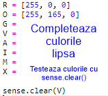
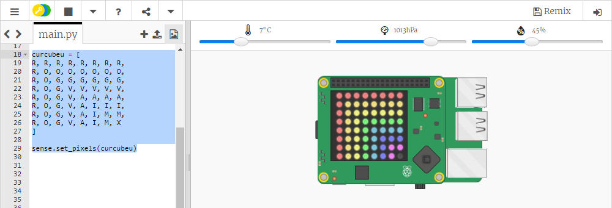

## Desenarea unui curcubeu

Mai întâi, hai să desenăm un curcubeu folosind matricea LED-urilor de pe Sense HAT. Culorile sunt roșu, portocaliu, galben, verde, albastru, indigo și violet.

Pentru a seta culoarea unui LED individual, trebuie să spunem cât de mult ar trebui să aibă roșu, verde și albastru, de la 0 la 255.

+ Deschide Trinket-ul de început pentru „Prezicător de curcubeie”: <a href="http://jumpto.cc/rainbow-go" target="_blank">jumpto.cc/curcubeu </a>.
    
    **Codul pentru configurarea Sense HAT a fost deja inclus pentru tine.**

+ Adaugă codul evidențiat pentru a configura o variabilă pentru culoarea roșie și apoi rotește toți pixelii roșii folosind `sense.clear(R)`:
    
    
    
    Asigură-te că folosești majuscula (litera mare) `R`.

+ Urmează portocaliul (oranj). Portocaliu este roșu amestecat cu verde. Poți ajusta numerele până când primești un portocaliu care îți place. Folosește `sense.clear(O)` de data aceasta pentru a testa noua culoare, asigurându-te că folosești o literă majusculă `O` între paranteze.
    
    

+ Acum, adaugă variabile `G`, `V`, `A`, `I`, `M<0>, astfel încât să ai cele șapte culori ale curcubeului. Poți găsi o listă cu o mulțime de culori pe <a href="http://jumpto.cc/colours" target="_blank">jumpto.cc/colours</a>

Îți poți testa culorile folosind <code>sense.clear()`.
    
    

+ Adaugă o variabilă `X` pentru a dezactiva pixelii (fără roșu, verde sau albastru):
    
    

+ Acum este timpul să desenăm un curcubeu. Trebuie să setezi o listă care să conțină culoarea fiecărui pixel și apoi să apelezi `set_pixels` cu lista de culori. Pentru a salva tasta poți copia curcubeul de la `snippets.py` în proiectul tău.
    
    