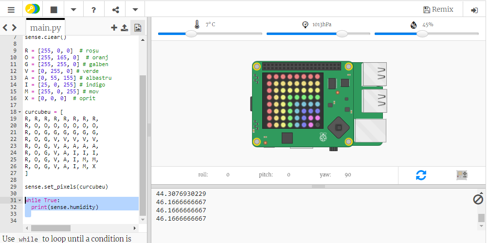

## Citirea datelor senzorilor

Sense HAT are o serie de senzori care furnizează date din lumea reală pe un calculator Raspberry Pi. Emulatorul Sense HAT din Trinket îți permite să scrii și să testezi proiecte pentru Sense HAT în browser-ul tău.

Senzorul umidității raportează cantitatea de umiditate din aer. Umiditatea este mare când plouă.

+ Hai să citim de la senzorul de umiditate și să tipărim rezultatul. Adaugă codul evidențiat în partea de jos a script-ului tău.
    
    

+ Testează-ți programul mutând glisorul umidității la valori diferite.
    
    
    
    Observă faptul că valoarea pe care o obții înapoi de la senzorul de umiditate nu este identică cu valoarea de pe slider. Asta se întâmplă pentru că senzorii nu măsoară perfect.