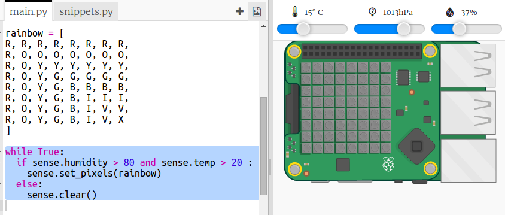

## Prezicerea unui curcubeu

Curcubeiele au loc atunci când soarele strălucește prin picături de apă în unghiul drept (de obicei, după-amiaza). Dacă e cald şi umiditatea e mare, atunci merită să verifici dacă există un curcubeu.

+ Acum, hai să arătăm curcubeul doar dacă condițiile sunt potrivite. Schimbă-ți codul pentru a arăta astfel:
    
    
    
    Nu poți fi sigur că există un curcubeu când aceste condiții sunt îndeplinite, dar merită să arunci o privire.

+ Încearcă să schimbi valorile de pe slider până când vezi curcubeul.
    
    
    
    Amintește-ți că valorile raportate nu vor fi exact aceleași cu cele afișate pe slidere.

+ Un *prag* este un număr care indică o schimbare importantă. Pragurile pentru detectorul de curcubeie sunt temperaturile de 20 de grade C și umiditate de 80%.
    
    Încearcă să schimbi pragurile și apoi să muți glisoarele pentru a declanșa un curcubeu.
    
    Dacă lucrezi cu un Sense HAT fizic, îți poți testa codul prin stabilirea pragurilor la valori mici.