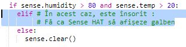

\--- challenge \---

## Provocare: Mai multă vreme

Can you display a sun image when the temperature is above 20 and the humidity is below 80%?

Sfat: Folosește `elif` pentru a verifica alte tipuri de vreme. Pentru fiecare tip de vreme trebuie să incluzi o condiție pentru a verifica un fel de vreme și apoi un cod pentru a seta afișarea pe Sense HAT.

Sfat: Poți crea un soare simplu setând toți pixelii la galben cu `clear()`. Sau poți încerca să creezi o imagine cu pixeli așa cum ai făcut-o cu curcubeul.

How about a snow image if the humidity is above 80% and the temperature is below zero?

Sfat: Setează roșu, verde și albastru la maxim 255 pentru a crea alb.

\--- /challenge \---