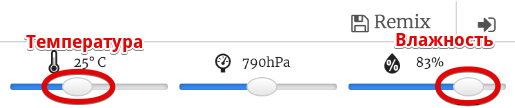

## Введение:

В этом проекте ты будешь использовать датчики температуры и влажности на Sense HAT для прогнозирования того, когда есть хороший шанс обнаружить радугу. Когда будут обнаружены правильные условия, ты отобразишь радугу на светодиодной матрице Sense HAT.

  <iframe src="https://trinket.io/embed/python/eaea4cb76c?outputOnly=true&start=result" width="600" height="500" frameborder="0" marginwidth="0" marginheight="0" allowfullscreen mark="crwd-mark">
</iframe> 

В эмуляторе Trinket ты можешь перемещать ползунки для изменения температуры и влажности, они выглядят так:

Ты получишь радугу, если температура превысит 20 градусов Цельсия, а влажность превысит 80 процентов. Попробуй поэкспериментировать, чтобы найти погодные условия для солнечных лучей (желтый) и снега (белый).

### Дополнительная информация для руководителей клуба

Если вам нужно распечатать этот проект, пожалуйста, используйте [Версию для печати](https://projects.raspberrypi.org/en/projects/rainbow-predictor/print).

## \--- collapse \---

## title: Заметки для руководителя клуба

## Введение:

В рамках этого проекта дети научатся использовать сенсоры Sense HAT для определения погоды, и отображать радугу с помощью светодиодной матрицы, когда погода теплая и влажная.

## Интернет-ресурсы

**В этом проекте используется Python 3.** Мы рекомендуем использовать [Trinket](https://trinket.io/), чтобы программировать на Python онлайн. Эта часть состоит из следующих trinket-ов:

* [Стартовый trinket «Радужный предсказатель» – jumpto.cc/rainbow-go](http://jumpto.cc/rainbow-go)

Есть также trinket, содержащий завершенный проект:

* [Завершенный «Радужный предсказатель» – trinket.io/python/eaea4cb76c](https://trinket.io/python/eaea4cb76c)

## Оффлайн ресурсы

Этот проект также может быть [завершен в автономном режиме](https://www.codeclubprojects.org/en-GB/resources/physical-sense-hat/) на компьютере Raspberry Pi с Sense HAT. Вы можете получить доступ к ресурсам проекта, щёлкнув ссылку «Материалы проекта» для этого проекта. Эта ссылка содержит раздел «Ресурсы проекта», включающий ресурсы, которые понадобятся детям, чтобы завершить этот проект в режиме оффлайн (автономном режиме). Убедитесь, что у каждого ребёнка есть доступ к копии этих ресурсов. Этот раздел содержит следующие файлы:

* rainbow/rainbow.py

Вы также можете найти завершенную версию этого проекта в разделе «Ресурсы волонтеров», который содержит:

* rainbow-finished/rainbow.py

(Все вышеперечисленные ресурсы также можно скачать как файлы `.zip` проекта и волонтера.)

## Цели обучения

* Физические вычисления - датчики;
* Логическое И (AND); 
* RGB цвета;
* Дисплей Sense HAT;

Этот проект основан на следующих модулях учебного плана [Raspberry Pi Digital Making](http://rpf.io/curriculum):

* [Комбинирование программных конструкций для решения задачи.](https://www.raspberrypi.org/curriculum/programming/builder)

## Задания

* Больше погоды - показывать различные изображения в разных погодных условиях. 

\--- /collapse \---

## \--- collapse \---

## title: Материалы проекта

## Ресурсы проекта

* [Стартовый проект](http://jumpto.cc/rainbow-go)
* [Python-файл для оффлайн старта](resources/rainbow-rainbow.py)

## Ресурсы для руководителя клуба

* [Завершенный Trinket проект (онлайн)](https://trinket.io/python/eaea4cb76c)
* [rainbow-finished/rainbow.py](resources/rainbow-final-rainbow.py)

\--- /collapse \---