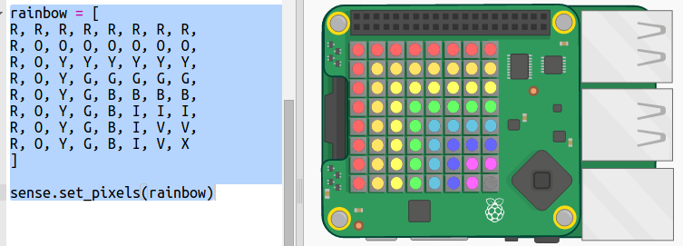

## Рисование радуги

Сначала давай нарисуем радугу, используя светодиодную матрицу на Sense HAT. Цвета: красный, оранжевый, желтый, зеленый, темно-синий, синий и фиолетовый.

Чтобы установить цвет отдельного светодиода, мы должны указать, сколько красного, зеленого и синего он должен иметь от 0 до 255.

+ Открой стартовый trinket «Радужный предсказатель»: <a href="http://jumpto.cc/rainbow-go" target="_blank">jumpto.cc/rainbow-go</a>.
    
    **Код для настройки Sense HAT был включен для тебя.**

+ Добавь выделенный код, чтобы задать переменную для красного цвета (Red), а затем окрась все пиксели в красный цвет, используя `sense.clear(R)`:
    
    
    
    Убедись, что ты используешь заглавную букву `R`.

+ Оранжевый – следующий. Оранжевый – это красный смешанный с зеленым. Ты можешь менять цифры, пока не получишь такой оранжевый, какой тебе нравится. На этот раз используй `sense.clear(O)`, чтобы проверить новый цвет, убедившись, что используется заглавная буква `O` в скобках.
    
    

+ Теперь добавь переменные `Y`, `G`, `B`, `I`, `V` для того, что у тебя были все семь цветов радуги. Ты можешь найти больше RGB цветов по ссылке: <a href="http://jumpto.cc/colours" target="_blank">jumpto.cc/colours</a>
    
    Ты можешь протестировать твои цвета с помощью `sense.clear()`.
    
    

+ Добавь переменную `X` для отключения пикселей (без красного, зеленого или синего цветов):
    
    

+ Теперь пришло время нарисовать радугу. Тебе нужно задать список, содержащий цвет каждого пикселя, а затем вызвать `set_pixels` со списком цветов. Чтобы набирать меньше кода ты можешь скопировать радугу из `snippets.py` в свой проект.
    
    