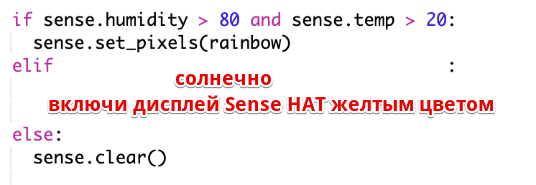

--- challenge ---

## Задание: Больше погоды

Отобразите изображение солнца, когда температура больше 20 и уровень влажности ниже 80%.

Совет: используй `elif`, чтобы проверить условия на другие виды погоды. Для каждого типа погоды тебе нужно добавить условие, чтобы проверить тип погоды, а затем написать код для отображения погоды на Sense HAT.

Подсказка: Ты можешь создать простое солнце, установив все пиксели в желтый цвет с помощью `clear()`. Или ты можешь попробовать создать пиксельное изображение, как ты сделал с радугой.

А теперь добавь изображение снежинки, когда уровень влажности выше 80% и температура ниже нуля.

Подсказка: установи красный, зеленый и синий в максимум (255), чтобы создать белый цвет.

--- /challenge ---

***

Этот проект был переведен волонтерами:

Сергей Градович
Artur (Atlassian)

Благодаря волонтерам мы можем дать возможность людям во всем мире учиться на их родном языке. Вы можете помочь нам привлечь больше волонтёров-переводчиков - подробнее на [rpf.io/translate](https://rpf.io/translate).