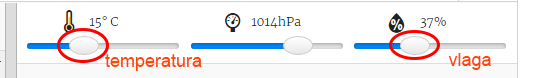

## Uvod

V tem projektu boš uporabil-a senzorja za temperaturo in vlago na SenseHAT, da predvidiš, kdaj so dobri pogoji, da bi lahko videl-a mavrico. Ko so zaznani pravi pogoji, boš prikazal mavrico na SenseHAT LED matrici.

  <iframe src="https://trinket.io/embed/python/eaea4cb76c?outputOnly=true&start=result" width="600" height="500" frameborder="0" marginwidth="0" marginheight="0" allowfullscreen mark="crwd-mark">
</iframe> 

V emulatorju Trinket lahko premikaš drsnike za spreminjanje temperature in vlage, ki so videti tako:

Če je temperatura preko 20 stopinj C in vlaga preko 80%, boš dobil mavrico. Eksperimentiraj, da najdeš vremenske pogoje za sonce (rumeno) in sneg (belo).

### Dodatne informacije za vodje klubov

Za tiskanje tega projekta, prosimo uporabite [tiskalniku prijazno različico](https://projects.raspberrypi.org/sl-SI/projects/rainbow-predictor/print).

--- collapse ---
---
title: Opombe za vodje klubov
---

## Uvod:

V tem projektu se bodo otroci naučili, kako uporabljati senzorje HAT Sense za zaznavanje vremena, in prikazati mavrico z uporabo LED matrice, ko je toplo in vlažno.

## Spletni viri

**Ta projekt uporablja Python 3.** Priporočamo uporabo [trinket-a](https://trinket.io/) za pisanje Python kode na spletu. Ta projekt uporablja naslednje trinket-e:

* ['Rainbow Predictor' Starter Trinket -- jumpto.cc/rainbow-go](http://jumpto.cc/rainbow-go)

Obstaja tudi trinket z dokončanim projektom:

* [‘Rainbow Predictor’ Finished -- trinket.io/python/38952d163b](https://trinket.io/python/38952d163b)

## Nespletni viri

Ta projekt lahko tudi [dokončate brez povezave](https://www.codeclubprojects.org/en-GB/resources/physical-sense-hat/) na računalniku Raspberry Pi s Sense HAT-om. Do virov tega projekta je mogoče dostopati s klikom na povezavo 'Materiali projekta'. Ta povezava vsebuje razdelek 'Viri projekta', ki vključuje vire, ki jih bodo otroci potrebovali za dokončanje tega projekta brez spletne povezave. Poskrbite, da ima vsak otrok dostop do kopije teh virov. Ta razdelek vključuje naslednje datoteke:

* rainbow/rainbow.py

Prav tako lahko najdete dokončano različico tega projekta v razdelku 'Viri za prostovoljce', ki vsebuje:

* rainbow-finished/rainbow.py

(Vsi zgoraj navedeni projektni viri in viri za prostovoljce se lahko prenesejo tudi kot `.zip` datoteke.)

## Učni cilji

* Fizično računalništvo - senzorji;
* Logični in; 
* RGB barve;
* Sense HAT zaslon;

Ta projekt zajema elemente iz [učnega načrta Raspberry Pi za digitalno ustvarjanje](http://rpf.io/curriculum):

* [Združevanje programskih konstrukt za reševanje problema.](https://www.raspberrypi.org/curriculum/programming/builder)

## Izzivi

* Več vremena - v različnih vremenskih pogojih prikaži različne slike. 

--- /collapse ---

--- collapse ---
---
title: Materiali projekta
---

## Viri projekta

* [.zip datoteka, ki vsebuje vse vire projekta](resources/rainbow-project-resources.zip)
* [Začetni projekt](http://jumpto.cc/rainbow-go)
* [Prazna Python datoteka, ki deluje brez povezave spletom](resources/rainbow-rainbow.py)

## Viri za vodje klubov

* [.zip datoteka, ki vsebuje vse dokončane vire projekta](resources/rainbow-volunteer-resources.zip)
* [Na spletu dokončan trinket projekt](https://trinket.io/python/38952d163b)
* [rainbow-finished/rainbow.py](resources/rainbow-final-rainbow.py)

--- /collapse ---