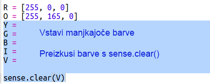
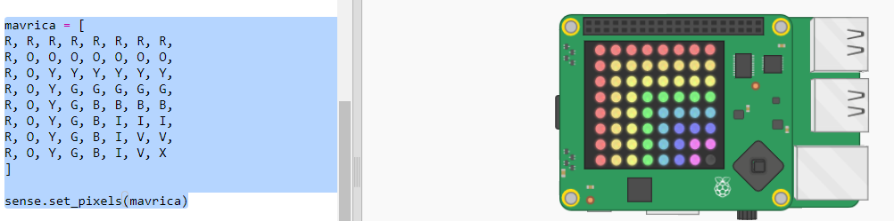

## Risanje mavrice

Najprej na LED matrici Sense HAT-a narišimo mavrico. Barve so rdeča, oranžna, rumena, zelena, modra, indigo in vijolična.

Za nastavitev barve posamezne LED moramo povedati, koliko rdeče, zelene in modre mora me 0 in 255 naj ima.

+ Odpri začetni trinket za Rainbow Predictor: <a href="http://jumpto.cc/rainbow-go" target="_blank">jumpto.cc/rainbow-go</a>.
    
    **Koda za nastavitev Sense HAT-a je že vključena.**

+ V osvetljenem delu kode ustvari spremenljivko za rdečo barvo in spremeni vse piksle v rdečo z uporabo `sense.clear(R)`:
    
    
    
    Bodi pozoren na to, da uporabiš veliko črko `R`.

+ Naslednja je oranžna. Oranžna je rdeča pomešana z zeleno. Številke lahko spreminjaš, dkoler ne dobiš oranžne, ki ti je všeč. Tokrat uporabi `sense.clear(O)` za preizkus nove barve in se prepričaj, da uporabljaš veliko črko `O` v oklepajih.
    
    

+ Dodaj spremenljivke `Y`, `G`, `B`, `I`, `V` da boš imel-a sedem barv mavrice. RGB barve lahko poiščeš na <a href="http://jumpto.cc/colours" target="_blank">jumpto.cc/colours</a>
    
    Barve lahko preizkusiš s `sense.clear()`.
    
    

+ Dodaj spremenljivko `X` za izklop pikslov (ne rdeča, ne modra):
    
    

+ Sedaj je čas, da narišeš mavrico. Narediti moraš seznam, ki vsebuje barvo vsakega piksla, nato pa poklicati `set_pixels` s seznamom barv. Če nočeš tipkati, lahko prekopiraš mavrico iz `snippets.py` v tvojem projektu.
    
    