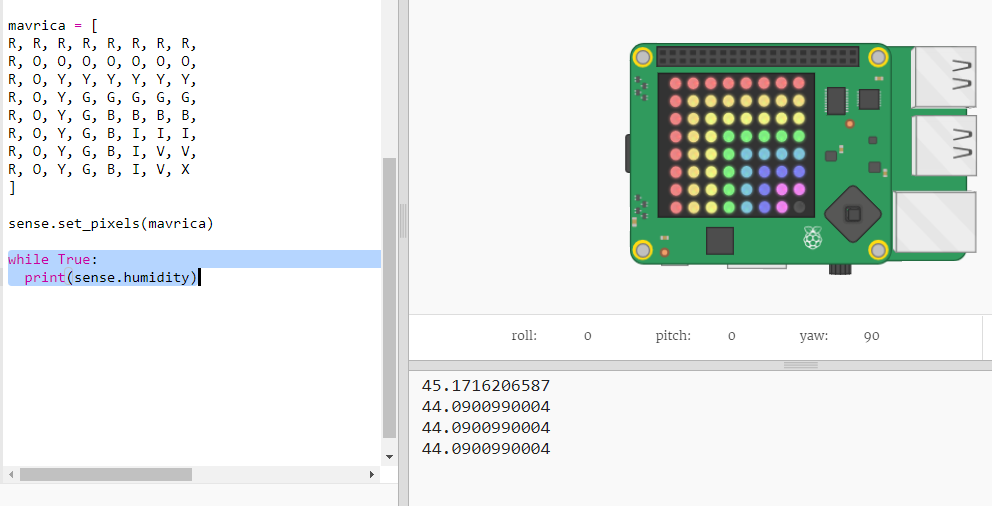

## Branje podatkov iz senzorja

Sense HAT ima niz senzorjev, ki posredujejo podatke iz resničnega sveta računalniku Rasberry Pi. Sense HAT Emulator v Trinketu omogoča pisanje in preizkušanje projektov za Sense HAT v spletnem brskalniku.

Senzor vlage podaja količino vlage v zraku. Vlažnost je velika, kadar dežuje.

+ Preberimo vrednost iz senzorja vlage in izpišimo rezultat. Dodaj osvetljeno kodo na dno tvojega skripta.
    
    

+ Preizkusi svoj program s premikanjem drsnika vlage na različne vrednosti.
    
    
    
    Bodi pozoren na to, da vrednost, ki jo senzor vlage vrne ni povsem enaka vrednosti na drsniku. Razolg je v tem, da senzorji niso povsem natančni.

    

