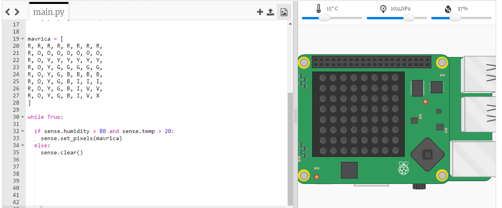

## Predvidevanje mavrice

Mavrice se pojavijo, ko sonce sije preko vodnih kapljic, pod pravilnim kotom (ponavadi popoldne). Če je toplo in je vlažnost velika, se plača preveriti ali se je pojavila mavrica.

+ Torej prikažimo mavrico zgolj ob pravih pogojih. Spremeni kodo, da bo videti tako:
    
    
    
    Ne moreš biti prepričan, da mavrica res je, kadar so ti pogoji izpolnjeni, vendar se splača pogledati.

+ Poskusi spremeniti vrednosti z drsnikom, dokler ne zagledaš mavrice.
    
    
    
    Zapomni si, da podane vrednosti ne bodo povsem enake tistim, ki so prikazane na drsniku.

+ *Prag* je številka, ki označuje pomembno spremembo. 20 stopinj Celzija in 80% vlage sta pragova zaznavalnika mavric.
    
    Poskusi spremeniti ta pragova, nato pa pomikaj drsnika, da sprožiš mavrico.
    
    Če delaš s fizičnim Sense HATom, lahko kodo preizkusiš tako, da nastaviš pragova na nizki vrednosti.