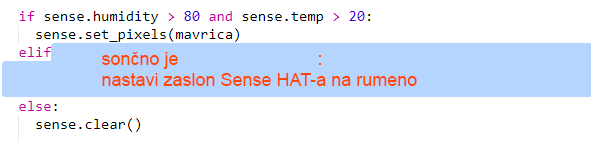

--- challenge ---

## Izziv: Več vremena

Ali lahko prikažeš sliko sonca, ko je temperatura preko 20 stopinj, vlažnost pa pod 80%.

Namig: Uporabi `elif`, da iščeš drugo vrsto vremena. Za vsako vrsto vremena moraš dodati pogoj, ki preveri to vremena, nato pa še kodo, ki nastavi zaslon na Sense HAT-u.

Namig: Preprosto sonce lahko ustvariš tako, da nastaviš vse piksle na rumeno z ukazom `clear()`. Lahko pa poskusiš narediti sliko iz pikslov, kot je to primer pri mavrici.

Kaj pa če ustvariš sliko snega, kadar je vlaga preko 80%, temperatura pa pod nič stopinj?

Namig: Nastavi rdečo, zeleno in modro na maksimalno vrednost 255, da ustvariš belo.

--- /challenge ---

***
Ta projekt so prevedli prostovoljci:

Arnold Marko

Zahvaljujoč prostovoljcem, lahko ljudem po vsem svetu omogočimo, da se učijo v svojem jeziku. S prostovoljnim prevajanjem nam lahko pomagate, da dosežemo več ljudi - več informacij na [rpf.io/translate](https://rpf.io/translate).