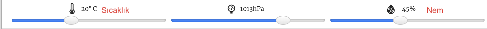

## Giriş:

Bu projede, Sense HAT üzerindeki sıcaklık ve nem sensörlerini, gökkuşağının oluşabileceği uygun zamanı tahmin etmede kullanacaksın. Doğru koşullar tespit edildiğinde, Sense HAT LED Matrisinde gökkuşağı görüntüleyeceksin.

  <iframe src="https://trinket.io/embed/python/eaea4cb76c?outputOnly=true&start=result" width="600" height="500" frameborder="0" marginwidth="0" marginheight="0" allowfullscreen mark="crwd-mark">
</iframe> 

Trinket öykünücüsünde sıcaklığı, basıncı ve nemi değiştirmek için kaydırıcıları dilediğin gibi hareket ettirebilirsin. Aşağıdaki gibi görünüyorlar:

Eğer sıcaklık 20 derece Santigrat üzerinde ve nemin de yüzde 80'in üzerinde olursa gökkuşağı elde edeceksin. Güneşli (sarı) ve karlı (beyaz) hava durumlarını bulmak için farklı sıcaklık ve nem kombinasyonlarını deneyebilirsin.

### Kulüp liderleri için ek bilgiler

Bu projeyi yazdırmanız gerekiyorsa, lütfen [Yazıcı dostu sürümü](https://projects.raspberrypi.org/en/projects/rainbow-predictor/print) kullanın.

## \--- küçült \---

## title: Kulüp lideri notları

## Giriş:

Bu projede, çocuklar Sense HAT sensörlerini kullanmayı ve sıcak ve nemli hava koşullarında LED matris üzerinde gökkuşağı görüntülemeyi öğrenecekler.

## Çevrimiçi Kaynaklar

**Bu proje Python 3'ü kullanıyor.** Çevrimiçi Python programlama için [trinket](https://trinket.io/) kullanmanı tavsiye ederiz. Bu proje aşağıdaki trinketleri içeriyor:

* ['Gökkuşağı Tahmincisi' Başlangıç Trinketi -- jumpto.cc/rainbow-go](http://jumpto.cc/rainbow-go)

Ayrıca tamamlanmış projeyi içeren bir trinket da bulunmaktadır:

* [‘Gökkuşağı Tahmincisi’ Bitmiş Hali -- trinket.io/python/eaea4cb76c](https://trinket.io/python/eaea4cb76c)

## Çevrimdışı Kaynaklar

Bu proje ayrıca Sense HAT ile Raspberry Pi bilgisayarda [çevrimdışı](https://www.codeclubprojects.org/en-GB/resources/physical-sense-hat/) olarak da tamamlanabilir. Bu proje için proje kaynaklarına, 'Proje Malzemeleri' bağlantısını tıklayarak erişebilirsiniz. Bu link, çocukların bu projeyi çevrimdışı tamamlamaları için ihtiyaç duyacağı kaynakları içeren bir 'Proje Kaynakları' bölümü içermektedir. Çocukların bu kaynakların bir kopyasına erişimi olduğundan emin olun. Bu bölüm aşağıdaki dosyaları içerir:

* rainbow/rainbow.py

Bu projenin tamamlanmış bir versiyonunu aşağıdakileri içeren 'Gönüllü Kaynaklar' bölümünde de bulabilirsiniz:

* rainbow-finished/rainbow.py

(Yukarıdaki kaynakların tümü proje ve gönüllü olarak indirilebilen `.zip` dosyalarıdır)

## Kazanımlar

* Fiziksel hesaplama - sensörler;
* Mantıksal "VE" Operatörü; 
* RGB renk modeli;
* Sense HAT ekranı;

Bu proje, [Raspberry Pi Digital Making Curriculum](http://rpf.io/curriculum) 'un aşağıdaki bölümlerinden unsurları kapsamaktadır:

* [Bir problemi çözmek için programlama yapılarını birleştirin.](https://www.raspberrypi.org/curriculum/programming/builder)

## Meydan Okumalar

* Daha Fazla Hava Durumu - farklı hava koşulları için farklı görüntüler görüntüleyin. 

\--- /collapse \---

## \--- collapse \---

## title: Proje materyalleri

## Proje kaynakları

* [Başlangıç projeleri](http://jumpto.cc/rainbow-go)
* [Çevrimdışı başlangıç Python dosyası](resources/rainbow-rainbow.py)

## Kulüp lideri için kaynaklar

* [Çevrimiçi tamamlanmış Trinket projesi](https://trinket.io/python/eaea4cb76c)
* [rainbow-finished/rainbow.py](resources/rainbow-final-rainbow.py)

\--- /collapse \---