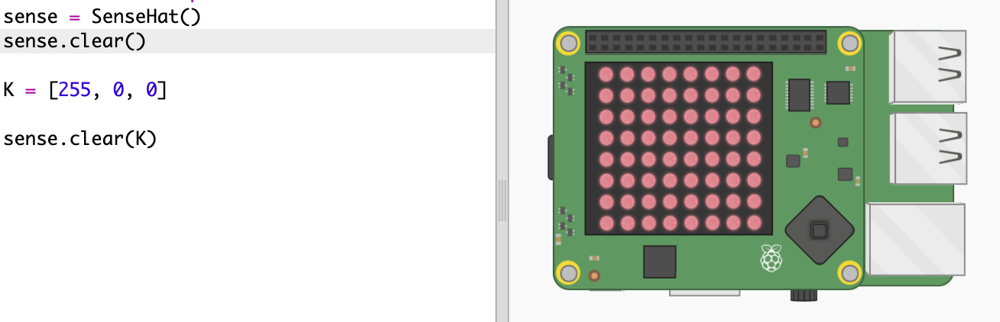
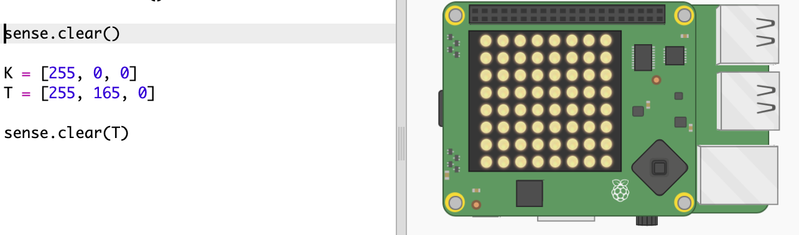
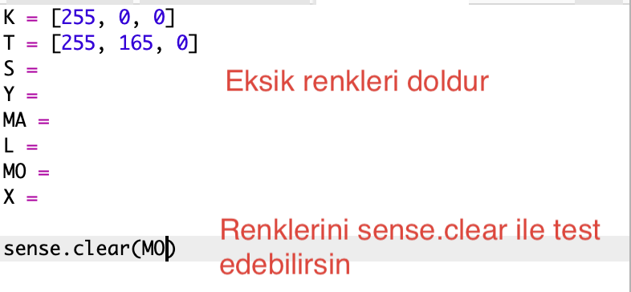
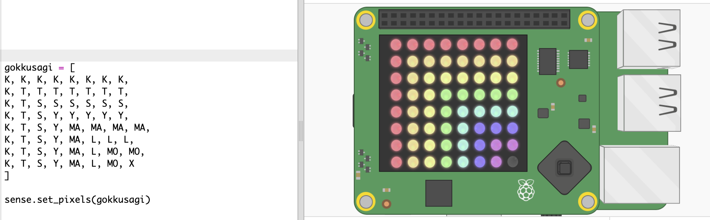

## Gökkuşağının çizilmesi

Öncelikle Sense HAT üzerindeki LED Matrisi kullanarak bir gökkuşağı çizelim. Kullanacağımız renkler: kırmızı, turuncu, sarı, yeşil, mavi, lacivert ve mor.

Bir LED'in rengini belirlemek için, o LED'in ne kadar kırmızı, yeşil ve mavi içermesi gerektiğini 0'la 255 arası bir sayıyla ifade etmek gerekiyor.

+ Rainbow Predictor Starter Trinket'ini aç: <a href="http://jumpto.cc/rainbow-go" target="_blank"> jumpto.cc/rainbow-go </a>.
    
    **Sense HAT'ın kurulum kodu senin için eklendi.**

+ Kırmızı renge bir değişken atamak için vurgulanan kodu ekle ve `sense.clear (K) ` kod parçasını kullanarak tüm pikselleri kırmızıya çevir:
    
    
    
    Büyük harf `K` harfini kullandığına emin ol.

+ Sırada turuncu var. Turuncu, kırmızı ve yeşilin karışımıdır. İstediğin tonda bir turuncu elde edene kadar sayıları değiştirebilirsin. Bu sefer `sense.clear(T)` kod parçasını kullanarak - büyük `T` ile - yeni rengini test et.
    
    

+ Şimdi gökkuşağı geri kalan renkleri için `S`, `Y`, `MA`, `L`, `MO` değişkenlerini ekleyin. RGB renk modeliyle alakalı daha fazla bilgiyi <a href="http://jumpto.cc/colours" target="_blank">jumpto.cc/colours</a> adresinde bulabilirsin.
    
    Renklerini `sense.clear()` kullanarak test edebilirsin.
    
    

+ Pikselleri kapalı olarak ayarlayabilmek için `X` değişkenini ekle.
    
    

+ Şimdi gökkuşağı çizme zamanı. Her pikselin rengini içeren bir liste tanımlaman ve ardından ` set_pixels` fonksiyonunu bu liste ile çağırman gerekiyor. Zamandan tasarruf etmek için `snippets.py` dosyasındaki gökkuşağını kopyalayabilirsin.
    
    