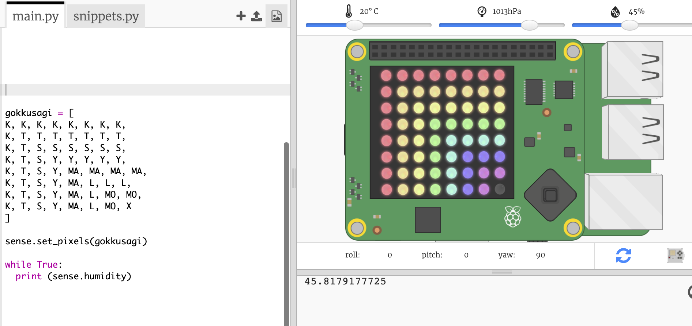
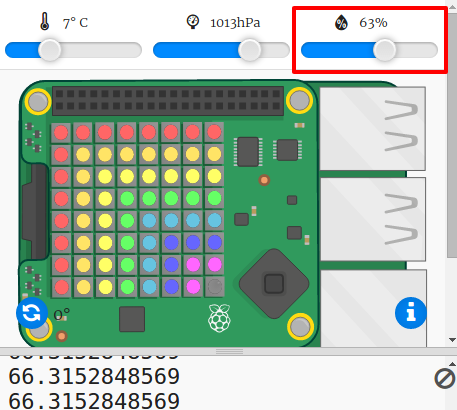

## Sensör verilerinin okunması

Sense HAT, Raspberry Pi bilgisayarına gerçek dünya verileri sağlayan bir dizi sensöre sahiptir. Trinket'teki Sense HAT Emulator, web tarayıcınızda Sense HAT için projeler yazmanıza ve onları test etmenize olanak tanır.

Nem sensörü havadaki nem miktarını ölçer. Nem ise yağmurlu havada yüksektir.

+ Nem sensöründen gelen veriyi okuyalım ve sonucu yazdıralım. Bunun için vurgulanan kodu komut dosyasının altına ekleyebilirsin.
    
    

+ Nem kaydırıcısını farklı değerlere getirerek programını test edebilirsin.
    
    
    
    Nem sensöründen okuduğun değerin, kaydırıcıdaki değerle tam olarak aynı olmadığına dikkat et. Bunun nedeni, sensörlerin tam olarak doğru olmamasıdır.