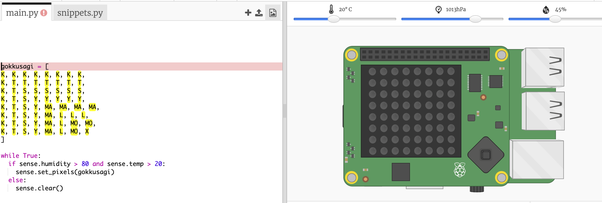

## Gökkuşağının tahmin edilmesi

Gökkuşağı, güneş su damlacıklarından doğru açıyla parladığında meydana gelir (genellikle öğleden sonra). Havanın sıcak ve nemli olduğu durumlarda gökkuşağı görülebilir.

+ Şimdi gökkuşağını sadece gerekli koşullar sağlanıyorsa gösterelim. Bunun için kodunu aşağıdaki gibi olacak şekilde değiştirebilirsin:
    
    
    
    Bu koşullar sağlansa da gerçekten gökkuşağı oluştuğundan emin olamazsın, ama yine de bir göz atmaya değer!

+ Gökkuşağını görene kadar kaydırıcıdaki değerleri değiştirmeyi dene.
    
    
    
    Daha önce de belirtildiği gibi, okunan değerlerin kaydırıcılarda gösterilenle tam olarak aynı olmayacağını unutma.

+ *Eşik değeri* önemli bir değişikliğin için sınır değerdir. 20 °C sıcaklık ve %80 nem gökkuşağı dedektörü için eşik değerleridir.
    
    Eşik değerlerini değiştirmeyi, ardından gökkuşağı oluşturmak için kaydırıcıları hareket ettirmeyi dene.
    
    Eğer fiziksel ölçümler yapan bir Sense HAT ile çalışıyorsan, eşikleri değerlerini düşürerek kodunu test edebilirsin.