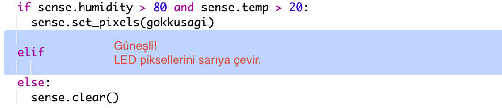

\--- meydan okuma \---

## Meydan Okuma: Daha fazla hava durumu

Sıcaklığın 20 °C'nin üzerinde ve nemin %80'in altında olduğu durumda güneş görüntüsü gösterebilir misin?

İpucu: `elif` koşul kipini diğer hava türlerini kontrol etmek kullanabilirsin. Her bir hava durumunu kontrol etmek için bir koşul eklemen ve ardından Sense HAT'ın ekranına görüntü çizdirmek için kod yazman gerekiyor.

İpucu: `clear()` ile tüm pikselleri sarıya ayarlayarak basit bir güneş oluşturabilirsin. Ya da gökkuşağında yaptığın gibi bir piksel görüntüsü oluşturmayı deneyebilirsin.

Nemin %80'in üzerinde ve sıcaklığın 0 °C'nin altında olduğu hava durumda kar görüntüsü çizdirmeye ne dersin?

İpucu: Beyaz renk oluşturmak için kırmızı, yeşil ve maviyi maksimum 255'e ayarla.

\--- /challenge \---