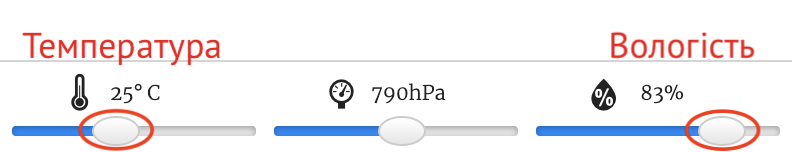

## Вступ:

В цьому проєкті ти використаєш датчики температури та вологості Sense HAT для визначення моменту, коли є великі шанси побачити веселку. Коли спостерігаються підходящі умови, ти відобразиш райдугу на світлодіодній матриці дисплею Sense HAT.

  <iframe src="https://trinket.io/embed/python/eaea4cb76c?outputOnly=true&start=result" width="600" height="500" frameborder="0" marginwidth="0" marginheight="0" allowfullscreen mark="crwd-mark">
</iframe> 

В емуляторі Trinket ти можеш рухати повзунки для зміни температури та вологості, вони виглядають так:

Ти отримаєш райдугу, коли температура перевищує 20 градусів Цельсія, а вологість перевищує 80 процентів. Спробуй поекспериментувати, щоб віднайти погодні умови для ясної сонячної погоди (жовтий) та снігу (білий).

### Додаткова інформація для керівників гуртка

Якщо вам потрібно роздрукувати цей проєкт, будь ласка, скористайтеся [версією для друку](https://projects.raspberrypi.org/en/projects/rainbow-predictor/print).

## \--- collapse \---

## title: Нотатки керівника гуртка

## Вступ:

В цьому проєкті діти навчаться використовувати датчики Sense HAT для визначення погоди та відображати райдугу на світлодіодній матриці, коли тепло та волого.

## Онлайн ресурси

**Цей проєкт використовує Python 3.** Ми рекомендуємо використовувати [Trinket](https://trinket.io/), що дозволяє писати код Python в браузері. Цей проєкт містить наступні ресурси Trinket:

* [Стартовий проєкт Trinket "Прогноз веселки" — jumpto.cc/rainbow-go](http://jumpto.cc/rainbow-go)

Також існує завершений проєкт Trinket:

* [Завершений "Прогноз веселки" — trinket.io/python/eaea4cb76c](https://trinket.io/python/eaea4cb76c)

## Офлайн ресурси

Цей проєкт також можна [виконати офлайн](https://www.codeclubprojects.org/en-GB/resources/physical-sense-hat/) на комп’ютері Raspberry Pi з розширенням Sense HAT. Ви можете отримати доступ до ресурсів проєкту, натиснувши на посилання "Матеріали проєкту". Це посилання містить розділ "Ресурси проєкту", який включає в себе ресурси, необхідні дітям для реалізації цього проєкту в режимі офлайн. Переконайтеся, що кожна дитина має доступ до копій цих ресурсів. Цей розділ містить наступні файли:

* rainbow/rainbow.py

Також, ви можете знайти завершену версію цього проєкту в розділі "Ресурси керівника клубу", яка містить:

* rainbow-finished/rainbow.py

(Всі вищезгадані ресурси доступні для завантаження як `.zip`-файли проєкту та керівника клубу.)

## Цілі навчання

* Програмування пристроїв з датчиками;
* Логічне І (AND); 
* Кольори RGB;
* Дисплей Sense HAT;

This project covers elements from the following strands of the [Raspberry Pi Digital Making Curriculum](https://rpf.io/curriculum):

* [Застосування простих програмних конструкцій для вирішення проблем.](https://www.raspberrypi.org/curriculum/programming/builder)

## Завдання

* Більше погоди — показати різні зображення за різних погодних умов. 

\--- /collapse \---

## \--- collapse \---

## title: Матеріали проєкту

## Ресурси проєкту

* [Starter project](http://jumpto.cc/rainbow-go)
* [Offline starter Python file](resources/rainbow-rainbow.py)

## Ресурси керівника клубу

* [Online completed Trinket project](https://trinket.io/python/eaea4cb76c)
* [rainbow-finished/rainbow.py](resources/rainbow-final-rainbow.py)

\--- /collapse \---