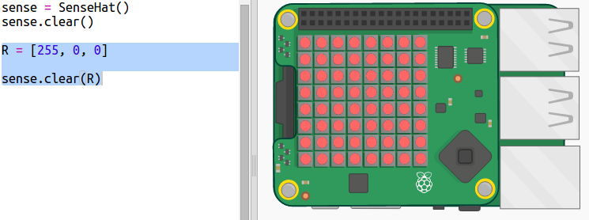
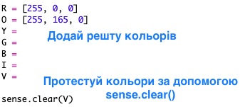

## Малювання веселки

Спочатку давай намалюємо веселку за допомогою матриці світлодіодів Sense HAT. Кольори такі: червоний (Red), оранжевий (Orange), жовтий (Yellow), зелений (Green), голубий (Blue), індіго (Indigo) та фіолетовий (Violet).

Щоб задати колір кожного світлодіода, нам треба визначити, скільки червоного (Red), зеленого (Green) або голубого (Blue) він повинен містити від 0 до 255.

+ Відкрий початковий проєкт "Прогноз веселки" у Trinket: <a href="http://jumpto.cc/rainbow-go" target="_blank">jumpto.cc/rainbow-go</a>.
    
    **Код для налаштування Sense HAT вже був підготовлений для тебе.**

+ Додай виділений код, щоб створити змінну для червоного (Red) кольору, а далі засвіти всі пікселі червоним за допомогою `sense.clear(R)`:
    
    
    
    Переконайся, що ти використовуєш велику літеру `R`.

+ Далі — оранжевий (Orange). Його можна отримати, змішавши червоний із зеленим. Ти можеш змінювати числа, поки не отримаєш такий відтінок оранжевого, який тобі подобається. Цього разу для перевірки нового кольору використовуй `sense.clear(O)`, переконавшись, що використовуєш велику літеру `O` в дужках.
    
    

+ Тепер додай змінні `Y`, `G`, `B`, `I`, `V`, щоб в тебе стало сім кольорів веселки. Ти можеш знайти кольори RGB тут: <a href="http://jumpto.cc/colours" target="_blank">jumpto.cc/colours</a>
    
    Ти можеш протестувати кольори за допомогою `sense.clear()`.
    
    

+ Додай змінну `X` для вимкнення пікселів (без червоного, зеленого та голубого):
    
    

+ А тепер час намалювати веселку. Тобі необхідно задати список із кольорами всіх пікселів, а потім викликати `set_pixels` із цим списком кольорів. Щоб не вводити багато тексту, ти можеш скопіювати веселку із файлу `snippets.py` в своєму проєкті.
    
    