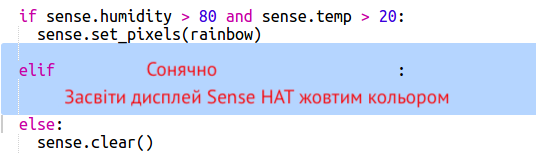

--- challenge ---

## Завдання: більше погоди

Чи можеш ти показати зображення сонця, коли температура вища 20, а вологість нижча 80%?

Порада: Використай `elif` для перевірки інших погодних умов. Для кожного типу погоди тобі потрібно буде додати умову для її перевірки, а потім запрограмувати відображення на Sense HAT.

Порада: Ти можеш створити просте сонце, встановивши всі пікселі в жовтий колір (yellow) за допомогою `clear()`. Або ти можеш створити піксельну картинку, як ти робив із веселкою.

А як щодо відображення снігу, коли вологість перевищує 80%, а температура опускається нижче нуля?

Порада: Встанови максимальне значення 255 для червоного (red), зеленого (green) та голубого (blue), щоб створити білий.

--- /challenge ---

