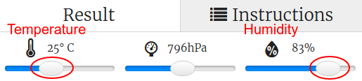

## 介绍：

In this project you will use the temperature and humidity sensors on the Sense HAT to predict when there’s a good chance of spotting a rainbow. When the right conditions are detected you will display a rainbow on the Sense HAT LED Matrix.

  <iframe src="https://trinket.io/embed/python/eaea4cb76c?outputOnly=true&start=result" width="600" height="500" frameborder="0" marginwidth="0" marginheight="0" allowfullscreen mark="crwd-mark">
</iframe> 

In the Trinket emulator you can move the sliders to change the temperature and humidity, they look like this:

You'll get a rainbow if the temperature is over 20 degrees C and the humidity is over 80 percent. Try experimenting to find the weather conditions for sunshine (yellow) and snow (white).

### 俱乐部导师的附加信息

如果您需要打印此项目，请使用[合适打印版本](https://projects.raspberrypi.org/en/projects/rainbow-predictor/print) 。

## \--- collapse \---

## title: 俱乐部导师说明

## 简介

In this project, children will learn how to use the Sense HAT sensors to detect the weather, and display a rainbow using the LED matrix when it's warm and humid.

## 在线资源

**This project uses Python 3.** We recommend using [Trinket](https://trinket.io/) to write Python online. 这个项目包含如下Trinket代码:

* ['Rainbow Predictor' Starter Trinket -- jumpto.cc/rainbow-go](http://jumpto.cc/rainbow-go)

还有一个已完成的Trinket：

* [‘Rainbow Predictor’ Finished -- trinket.io/python/eaea4cb76c](https://trinket.io/python/eaea4cb76c)

## 离线资源

This project can also be [completed offline](https://www.codeclubprojects.org/en-GB/resources/physical-sense-hat/) on a Raspberry Pi computer with a Sense HAT. 你可以点击本项目的“项目资料”链接访问项目资源。 这个链接包含一个 “项目资源” 部分，里面有孩子们完成该项目所需的离线资源。 请确保每个孩子都能获得这些资源。 这部分包含如下文件：

* rainbow/rainbow.py

你也可以在 “志愿者资源'”部分找到该项目的完成版本，里面包含：

* rainbow-finished/rainbow.py

(上述所有资源也可以以`.zip`压缩包的形式下载。)

## 学习目标

* Physical computing - sensors;
* Boolean AND; 
* RGB Colours;
* Sense HAT display;

本项目涵盖[树莓派数字制作课程](http://rpf.io/curriculum)如下几方面内容：

* [综合利用编程结构解决问题。](https://www.raspberrypi.org/curriculum/programming/builder)

## 挑战

* More Weather - display different images under different weather conditions. 

\--- /collapse \---

## \--- collapse \---

## title: 项目资源

## 项目资源

* [包含所有项目资源的.zip文件](resources/rainbow-project-resources.zip)
* [Starter project](http://jumpto.cc/rainbow-go)
* [Offline starter Python file](resources/rainbow-rainbow.py)

## 俱乐部导师资源

* [包含所有完成项目资源的.zip文件](resources/rainbow-volunteer-resources.zip)
* [在线已完成的Trinket项目](https://trinket.io/python/eaea4cb76c)
* [rainbow-finished/rainbow.py](resources/rainbow-final-rainbow.py)

\--- /collapse \---