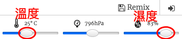

## 介紹:

在這個專案中，你將會使用在Sense HAT上的溫度及濕度的感應器來預測何時會有好的機會來發現彩虹。 當對的情況被偵測到，你將會在Sense HAT LED Matrix上顯示一道彩虹。

  <iframe src="https://trinket.io/embed/python/eaea4cb76c?outputOnly=true&start=result" width="600" height="500" frameborder="0" marginwidth="0" marginheight="0" allowfullscreen mark="crwd-mark">
</iframe> 

在Trinket模擬器上，你可以移動滑桿來改變溫度及濕度，他們看起來像這樣：

如果溫度超過攝氏20度、濕度超過百分之80，你將會得到一道彩虹。 試著實驗找出適合陽光（黃色）及下雪（白色）的天氣狀況。

### Code Club 工作人員延伸閱讀

如果你需要列印這個專案，可以先切換成[列印友好模式](https://projects.raspberrypi.org/en/projects/rainbow-predictor/print)。

## \--- collapse \---

## 標題: 給教師的其它資訊

## 介紹:

在此專案中，孩子們將學會如何使用Sense HAT感應器來偵測天氣，並在溫暖又潮濕的條件中使用LED矩陣顯示一道彩虹。

## 線上資源

**這個專案使用 Python 3。**我們建議利用 [trinket](https://trinket.io/) 在線上撰寫 Python 程式碼。 這項專案包括以下 Trinkets：

* [“彩虹預測器”'入門專案-jumpto.cc/rainbow-go](http://jumpto.cc/rainbow-go)

還有一個包含完成的專案的trinket：

* [完成的“彩虹預測器”-trinket.io/python/eaea4cb76c](https://trinket.io/python/eaea4cb76c)

## 離線資源

此專案可以在[離線狀態](https://www.codeclubprojects.org/en-GB/resources/physical-sense-hat/)的具有Sense HAT感測器的Raspberry Pi電腦上完成。 你可以從點擊「專案資料」連結取得專案相關資源。 此連結內有一個“專案資源”區塊，包含學生在離線狀態中完成此專案的所有資源。 務必檢查每個學生都有辦法拿到這些資源。 本節包括以下檔案：

* rainbow/rainbow.py

你還可以在「志工相關資源」部分中找到內含此專案的完成版本，包括以下文件：

* rainbow-finished/rainbow.py

（以上所有資源也像專案一樣可以讓志工下載成`.zip`檔案。）

## 學習目標

* 物理運算-感測器；
* 布林值 AND； 
* RGB顏色；
* Sense HAT顯示器；

This project covers elements from the following strands of the [Raspberry Pi Digital Making Curriculum](https://rpf.io/curriculum):

* [結合程式設計結構來解決問題。](https://www.raspberrypi.org/curriculum/programming/builder)

## 挑戰

* 更多天氣-在不同的天氣條件下顯示不同的圖像。 

\--- /collapse \---

## \--- collapse \---

## 標題：專案材料

## 專案資源

* [初始專案](http://jumpto.cc/rainbow-go)
* [離線的初始Python 檔案](resources/rainbow-rainbow.py)

## 教師資源

* [線上完成的Trinket專案](https://trinket.io/python/eaea4cb76c)
* [rainbow-finished/rainbow.py](resources/rainbow-final-rainbow.py)

\--- /collapse \---