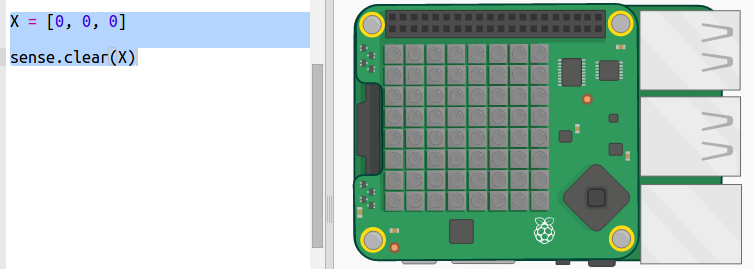

## 畫一道彩虹

首先，讓我們使用Sense HAT上的LED Matrix繪製一道彩虹。 顏色包含紅色，橘色，黃色，綠色，藍色，靛藍和紫羅蘭色。

要設置單個LED的顏色，我們需要指出0到255之間，紅色，綠色和藍色分別應該為多少。

+ 打開彩虹預測器入門專案：<a href="http://jumpto.cc/rainbow-go" target="_blank"> jumpto.cc/rainbow-go </a> 。
    
    **隨附了用於設置Sense HAT的程式碼。**

+ 新增這些凸顯標示的程式碼作為設定紅色的變數，然後使用`sense.clear(R)`將所有像素變為紅色：
    
    
    
    請確定你使用大寫英文字母`R`。

+ 橘色是下一個。 橘色是紅色和綠色的混合。 你可以調整這些數字，直到你獲得所需要的橘色為止。 這次使用 `sense.clear(O)` 來測試新顏色，確保在括號中使用大寫字母`O`。
    
    

+ 現在，新增變數`Y`，`G`，`B`，`I`，`V`，如此你便有了彩虹的七種顏色。 你可以在<a href="http://jumpto.cc/colours" target="_blank">jumpto.cc/colours</a>查找RGB顏色
    
    你可以使用`sense.clear()`測試你的顏色 。
    
    

+ 新增變數`X`用於將像素設定為關閉（沒有紅色，綠色或藍色）：
    
    

+ 現在，是時候畫一道彩虹了。 您需要建立一個包含每個像素顏色的列表，然後呼叫`set_pixels`來調用顏色列表。 要保存輸入的內容，你可以從你的專案中的`snippets.py`複製這個彩虹。
    
    