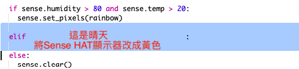

\--- challenge \---

## 挑戰：更多天氣

你有辦法展示一個氣溫高於20度且濕度低於百分之80的太陽圖案嗎？

提示：使用`elif`檢查其他類型的天氣。 針對每一種天氣，你都需要包含一個條件來檢查確認為該天氣，然後編寫程式碼來設定在Sense HAT的顯示器。

提示：你可以透過使用`clear()`將所有像素設置為黃色來建立一個簡單的太陽。 或者，你可以嘗試像建立彩虹一樣來建立一個像素圖像。

那展示一個濕度大於百分之80且氣溫低於0度的下雪圖案呢？

提示：將紅色，綠色和藍色設置為最大值255，來創建白色。

\--- /challenge \---